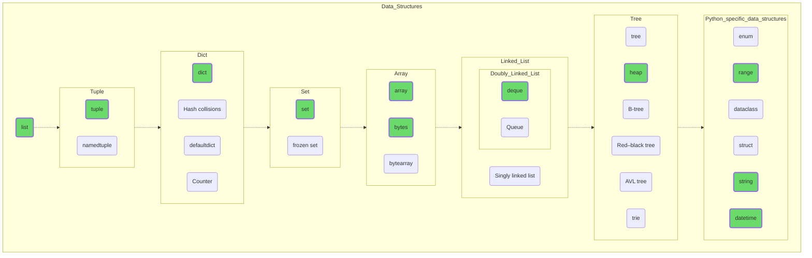

## Data Structures

As a reminder, if you are a novice developer, go from left to right through the entries marked in green. Create instances of each type, try adding and removing elements, and experiment with them via the debugger. See how big the resulting objects are, and try to figure out why list and array containing the same data are different in size. Study the features of each type, read and figure out which data structure will work best for which tasks.

Don't forget that this is just a guide, a table of contents for a book that you will have to write yourself. Actively seek information on the web, consult sources and official documentation. Dive [Stackoverflow](https://stackoverflow.com/) just for fun, there's plenty of exciting reading there!

If you start to make progress, move on to the next section, and don't feel bad if you can't. Don't envision your mind as the sword of Alexander the Great cutting the Gordian knot in one fluid, precise move, worthy of Instagram's front page. Be as a carpenter’s plane, stripping away one thin layer at a time, and sooner or later the misunderstanding will go away, even if this seems to you to be a chasm ten thousand leagues deep.

