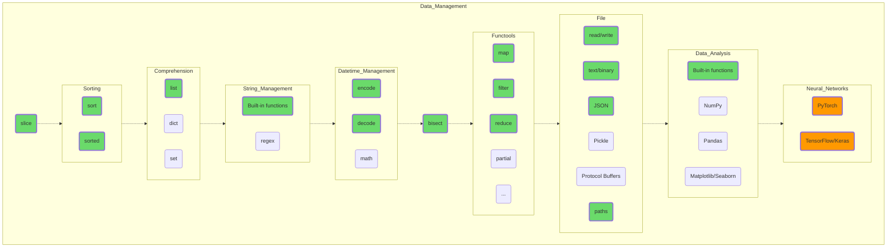

## Data Management

Try to manipulate your data, feel how you can mold anything you want out of this malleable clay. Try creating a data structure with many elements (a million, for example), sort them, quickly find the values you want with bisect, and write the results in a JSON file.

If everything goes according to plan, try to dig into the less obvious topics: apply regex to solve some simple task or save previously obtained data in Pickle format, understanding the reason for binary file formats after observing the size of the resulting files.

This is where you will find the first entries marked in orange. Google what TensorFlow and Keras are and what tasks they solve. Perhaps, this could be your future job, your vocation!

