## Data Flows

Add more specific capabilities to your data management skills. All of the topics covered are essential in the practical programming process and are present in all modern languages in one form or another. That way, if you eventually switch from Python to Java, C# or C++, the knowledge you've acquired won't become dead weight.

```mermaid
flowchart TD

subgraph Data_Flows
direction LR

itertools -.-> enumerate -.-> Generator -.-> Decorator -.-> Context_managers

subgraph itertools
direction LR

subgraph Infinite_Iterators
icount(count)
icycle(cycle)
irepeat(repeat)
end

subgraph Finite_Iterators
accumulate(accumulate)
chain(chain)
compress(compress)
dropwhile(dropwhile)
takewhile(takewhile)
fimore(...)
end

subgraph Combinatorics
product(product)
combinations(combinations)
permutations(permutations)
combinations_with_replacement(combinations_with_replacement)
end
end

enumerate(enumerate)

subgraph Generator
direction LR
yield("yield")
yield_from("yield from")
Generator_expression("Generator expression")
end

subgraph Decorator
direction LR
decorator(decorator)
LRUCache("LRU Cache")
param_decorator("Parameterized decorator")
end

subgraph Context_managers
direction LR
enter_exit_cm("__enter__, __exit__")
contextlib(contextlib)
end

end

classDef trainee fill:#6ADA6A, stroke-width:3px
classDef middle fill:#FF9900, stroke-width:3px

class List trainee;
class tuple trainee;
class dict trainee;
class set trainee;
class array trainee;
class bytes trainee;
class deque trainee;
class heap trainee;
class range trainee;
class string trainee;
class datetime trainee;
class slice trainee;
class sort trainee;
class sorted trainee;
class listcomprehension trainee;
class bisect trainee;
class fmap trainee;
class ffilter trainee;
class freduce trainee;
class String_Built-in_Functions trainee;
class encode trainee;
class decode trainee;
class Read_Write trainee;
class Text_Binary trainee;
class JSON trainee;
class paths trainee;
class Data_Built-in_Functions trainee;
class icount trainee;
class icycle trainee;
class irepeat trainee;
class product trainee;
class combinations trainee;
class enumerate trainee;
class yield trainee;
class decorator trainee;
class enter_exit_cm trainee;
class oopBase1 trainee;
class oop_property trainee;
class staticmethod trainee;
class classmethod trainee;
class slots trainee;
class Comparable trainee;
class Hashable trainee;
class Sortable trainee;
class Iterable trainee;
class Collection trainee;
class shallow trainee;
class deep trainee;
class objInheritance trainee;
class Multiple_Inheritance trainee;
class MRO trainee;
class reference_counting trainee;
class garbage_collector trainee;
class GIL trainee;
class args_kwargs trainee;
class lambda trainee;
class exception_handling trainee;
class built_in_exceptions trainee;
class exception_raising trainee;
class create_task trainee;
class gather trainee;
class sleep trainee;
class run trainee;
class wait_for trainee;
class asQueue trainee;
class Lock trainee;
class Event trainee;
class variables trainee;
class Thread trainee;
class Pool trainee;
class Stopwatch trainee;
class timeit trainee;
class random_mod trainee;
class input trainee;
class Command_Line_Arguments trainee;
class simple_print trainee;
class MD5 trainee;
class AES trainee;
class pytest trainee;
class FizzBuzz trainee;
class BubbleSort trainee;
class QuickSort trainee;
class RadixSort trainee;
class Adjacency_Matrix trainee;
class Adjacency_List trainee;
class Linear_Search trainee;
class Binary_Search trainee;
class DFS trainee;
class bigo trainee;
class divide_and_conquer trainee;
class Greedy_algorithm trainee;
class Recursion trainee;
class Relational_model trainee;
class Transaction trainee;
class Isolation trainee;
class PostgreSQL_benefits trainee;
class peewee trainee;
class CREATE trainee;
class ALTER trainee;
class DROP trainee;
class SELECT trainee;
class INSERT trainee;
class UPDATE trainee;
class DELETE trainee;
class PRIMARY_KEY trainee;
class FOREIGN_KEY trainee;
class FROM trainee;
class WHERE trainee;
class SET trainee;
class SQLite_benefits trainee;
class Syntax_Diagrams trainee;
class Flask trainee;
class Consistency trainee;
class HTTPS trainee;
class requests trainee;
class websocket trainee;
class GitHub_Actions trainee;
class WhatIsArch trainee;
class SRP trainee;
class OCP trainee;
class LSP trainee;
class ISP trainee;
class DIP trainee;
class coupling_vs_cohesion trainee;
class Procedural trainee;
class parObject-oriented trainee;
class ooInheritance trainee;
class Encapsulation trainee;
class Polymorphism trainee;
class Abstraction trainee;
class trunk_based_development trainee;
class aiohttp trainee;
class StreamHandler trainee;
class Observer trainee;
class Decorator_Method trainee;
class Factory_Method trainee;
class Adapter_Facade trainee;
class CQRS trainee;
class Decentralization trainee;
class Smart_endpoints_dumb_pipes trainee;
class Basics trainee;
class GitHub trainee;
class Install trainee;
class Directory_Structure trainee;
class Terminal trainee;
class accumulate trainee;
class chain trainee;
class compress trainee;
class dropwhile trainee;
class takewhile trainee;

class bash middle;
class System_administration middle;
class Network_administration middle;
class NoSQL middle;
class Functional middle;
class RabbitMQ middle;
class Scrum middle;
class Apache_Kafka middle;
class Docker middle;
class methmore middle;
class PostgreSQL_more middle;
class SQLAlchemy middle;
class Django_ORM middle;
class Django middle;
class FastAPI middle;
class SQL_standard middle;
class Analyze_an_execution_plan middle;
class TensorFlow middle;
class Keras middle;
class cryptomore middle;
class Jenkins middle;
class Kubernetes middle;
class Creational_patterns middle;
class Structural_patterns middle;
class Behavioral_patterns middle;
class Architectural_Patterns middle;
class ELK_Stack middle;
class Pattern_of_Distributed_Systems middle;
class Cloud_Design_Patterns middle;
class New_Relic middle;
```

