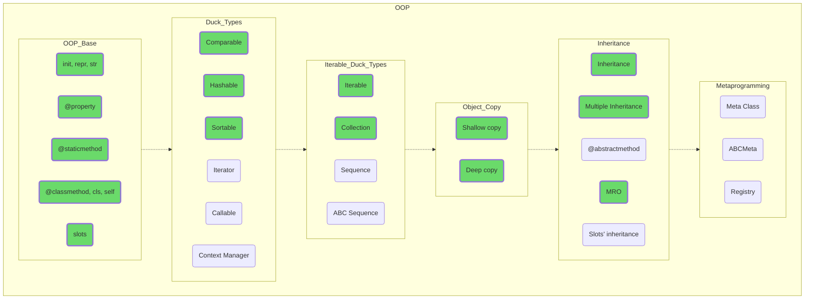

## Object-Oriented Programming

Dive into the subject of object-oriented programming. Understand that objects are your friends, and all their features and properties, even if they are not quite intuitive at first glance, have purely utilitarian reasons for existing.

OOP makes it much easier to partition, develop and maintain code, not just making very complex tasks feasible for average programmers, but making the world around us more manageable, predictable and generally better.

