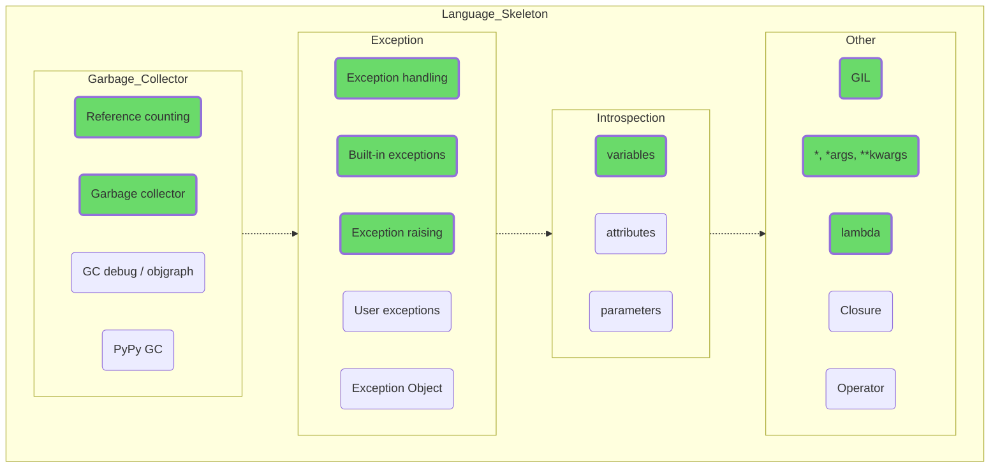

## Специфика языка

Так, отлично, еще немного глубже. Изучение особенностей работы GIL или GC даст вам понимание, почему в том или ином случае всё идет наперекосяк, совсем не так, как вы планировали. А исключения вы, возможно, уже вовсю используете, учитывая их возможное возникновение при некоторых операциях со структурами данных, так что просто изучите их поглубже.

