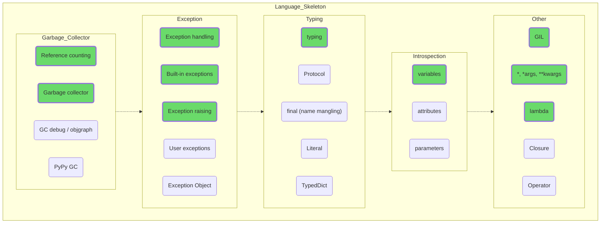

## Language Skeleton

Perfect, a bit deeper now. Studying how GIL or GC works will give you an understanding of why things go awry in one case or another, not at all the way you planned. You are likely to use exceptions all the time, given that they can occur in some operations with data structures, so study them further.

