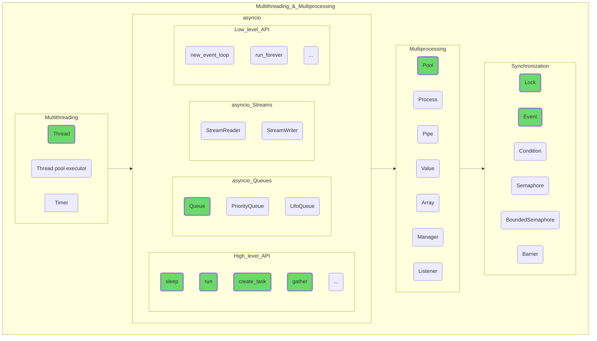

## Multithreading and Multiprocessing

Before you dive into multithreading and multiprocessing, be sure to study their typical use cases. There may be situations in which the gain is minimal or non-existent.

Try to implement simultaneous fast data processing and waiting for user input, which changes the input data for calculations, so you understand the capabilities, pros and cons of different approaches.

Don't try to use all the features provided by Python at once, stick to the task at hand.

