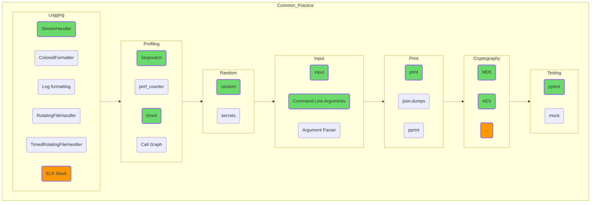

## Common Practices

Description of common methods used in almost all software projects, not just in Python. I/O, profiling, and logging apply universally.

Testing in general constitutes a separate profession, and often the quality of a software product can be judged by the test coverage of the source code. For example, the code of the SQLite database is 100% [covered by tests](https://www.sqlite.org/testing.html), while one line of "combative" code requires 608 lines of tests.  
Jokes aside, projects with 100% coverage are not common, but pytest used wisely is the best guarantor of your sound sleep at night!

