## Общая практика

Описание распространенных подходов, используемых практически во всех программных проектах, и не только на Python. Ввод-вывод, профилирование, логгирование применимо абсолютно везде.

Тестирование вообще составляет отдельную профессию, и часто о качестве программного продукта можно судить по тестовому покрытию исходного кода. С умом (но и без фанатизма) используемый pytest служит лучшим гарантом вашего крепкого сна по ночам, кроме шуток!

```mermaid
flowchart TD

subgraph Common_Practice
direction LR

Logging -.-> Profiling -.-> Random -.-> Input -.-> Print -.-> Cryptography -.-> Testing

Logging(Logging)

subgraph Profiling
direction LR
Stopwatch(Stopwatch)
perf_counter(perf_counter)
timeit
Call_Graph("Call Graph")
end

Random(Random)

subgraph Input
direction LR
input(input)
Command_Line_Arguments("Command Line Arguments")
Argument_Parser("Argument Parser")
end

subgraph Print
direction LR
simple_print(print)
json_print("json print")
Pretty_Print("Pretty Print")
end

subgraph Cryptography
direction LR
MD5(MD5)
AES(AES)
cryptomore("...")
end

subgraph Testing
direction LR
pytest(pytest)
mock(mock)
end

end

classDef trainee fill:#6ADA6A, stroke-width:3px
classDef middle fill:#FF9900, stroke-width:3px

class List trainee;
class tuple trainee;
class dict trainee;
class set trainee;
class array trainee;
class bytes trainee;
class deque trainee;
class heap trainee;
class range trainee;
class string trainee;
class datetime trainee;
class slice trainee;
class sort trainee;
class sorted trainee;
class listcomprehension trainee;
class bisect trainee;
class fmap trainee;
class ffilter trainee;
class freduce trainee;
class String_Built-in_Functions trainee;
class encode trainee;
class decode trainee;
class Read_Write trainee;
class Text_Binary trainee;
class JSON trainee;
class paths trainee;
class Data_Built-in_Functions trainee;
class icount trainee;
class icycle trainee;
class irepeat trainee;
class pairwise trainee;
class product trainee;
class combinations trainee;
class enumerate trainee;
class generator trainee;
class decorator trainee;
class context trainee;
class oopBase1 trainee;
class oop_property trainee;
class staticmethod trainee;
class classmethod trainee;
class slots trainee;
class Comparable trainee;
class Hashable trainee;
class Sortable trainee;
class Iterable trainee;
class Collection trainee;
class shallow trainee;
class deep trainee;
class objInheritance trainee;
class Multiple_Inheritance trainee;
class MRO trainee;
class reference_counting trainee;
class garbage_collector trainee;
class GIL trainee;
class args_kwargs trainee;
class lambda trainee;
class exception_handling trainee;
class built_in_exceptions trainee;
class exception_raising trainee;
class create_task trainee;
class gather trainee;
class wait_for trainee;
class asQueue trainee;
class Lock trainee;
class Event trainee;
class variables trainee;
class Thread trainee;
class Pool trainee;
class Logging trainee;
class Stopwatch trainee;
class timeit trainee;
class Random trainee;
class input trainee;
class Command_Line_Arguments trainee;
class simple_print trainee;
class MD5 trainee;
class AES trainee;
class pytest trainee;
class FizzBuzz trainee;
class BubbleSort trainee;
class QuickSort trainee;
class RadixSort trainee;
class Adjacency_Matrix trainee;
class Adjacency_List trainee;
class Linear_Search trainee;
class Binary_Search trainee;
class DFS trainee;
class bigo trainee;
class divide_and_conquer trainee;
class Greedy_algorithm trainee;
class Recursion trainee;
class Relational_model trainee;
class Transaction trainee;
class Isolation trainee;
class PostgreSQL_benefits trainee;
class peewee trainee;
class CREATE trainee;
class ALTER trainee;
class DROP trainee;
class SELECT trainee;
class INSERT trainee;
class UPDATE trainee;
class DELETE trainee;
class SQLite trainee;
class Flask trainee;
class Consistency trainee;
class HTTPS trainee;
class requests trainee;
class websocket trainee;
class GitHub_Actions trainee;
class WhatIsArch trainee;
class SRP trainee;
class OCP trainee;
class LSP trainee;
class ISP trainee;
class DIP trainee;
class coupling_vs_cohesion trainee;
class Procedural trainee;
class parObject-oriented trainee;
class ooInheritance trainee;
class Encapsulation trainee;
class Polymorphism trainee;
class Abstraction trainee;
class trunk_based_development trainee;
class aiohttp trainee;

class NoSQL middle;
class Functional middle;
class RabbitMQ middle;
class Scrum middle;
class Apache_Kafka middle;
class git middle;
class Linux middle;
class Docker middle;
class methmore middle;
class PostgreSQL_more middle;
class SQLAlchemy middle;
class Django middle;
class FastAPI middle;
class ORM boldmiddleed;
class TensorFlow middle;
class Keras middle;
class cryptomore middle;
class Jenkins middle;
class Kubernetes middle;
class Architectural_Patterns middle;

```

