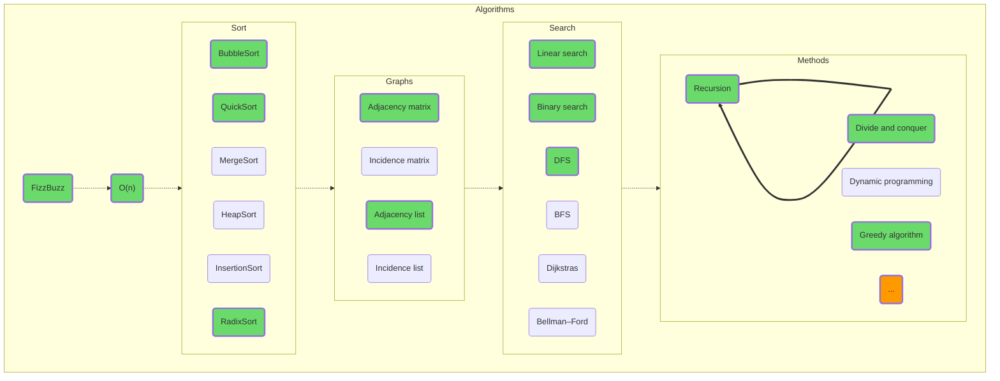

## Algorithms

One of those areas of human knowledge that you can delve into endlessly. On the other hand, the learning curve of this discipline for covering the practical needs of the average programmer has long been known, so the initial stages shouldn't be too difficult for you. Who knows, maybe you'll enjoy it so much and drag it out that in time you might even be able to contribute a new robust argument in the discussion of “[Equality of P and NP classes](https://en.wikipedia.org/wiki/P_versus_NP_problem)”!

