## Базы данных

Изучите сначала общие понятия, а потом специфику работы с конкретными системами управления базами данных. Попробуйте поработать с SQLite, даже если позже вы планируете перейти на PostgreSQL. SQLite является очень популярной БД, используется в Android, Chromium и еще в десятках популярных проектов. Вы же можете использовать SQLite в качестве удобного локального хранилища, как альтернативу прямой работе с файлами.

Попробуйте, кстати, ненадолго вернуться к главе первой, «Структуры данных» и разобраться, как и почему устроены внутренности баз данных.

Здесь, кстати, расположена еще одна дверь в «параллельные миры». Может быть вы захотите связать свое будущее с базами данных, став [DBA](https://en.wikipedia.org/wiki/Database_administrator)?

```mermaid
flowchart TD

subgraph Database
direction LR

Database_basics -.-> SQL -.-> SQLite -.-> MySQL -.-> PostgreSQL -.-> ORM -.-> Analyze_an_execution_plan

subgraph Database_basics
direction LR
Relational_model("Relational model")
Transaction(Transaction)
subgraph ACID
Consistency(Consistency)
Isolation(Isolation)
end
Nplusone("N+1 problem")
SQL_injection("SQL injection")
NoSQL(NoSQL)
end

subgraph SQL
direction LR

subgraph DDL
CREATE(CREATE)
ALTER(ALTER)
DROP(DROP)
PRIMARY_KEY("PRIMARY KEY")
FOREIGN_KEY("FOREIGN KEY")
ddlmore("...")
end

subgraph DML
SELECT(SELECT)
INSERT(INSERT)
UPDATE(UPDATE)
DELETE(DELETE)
FROM(FROM)
WHERE(WHERE)
SET(SET)

dmlmore("...")
end

DCL(DCL)
TCL(TCL)
SQL_standard("SQL standard")

end

subgraph SQLite
direction LR
SQLite_benefits("SQLite benefits")
Syntax_Diagrams("Syntax Diagrams")
DB_Browser_for_SQLite("DB Browser for SQLite")
end

subgraph MySQL
direction LR
MySQL_Workbench("MySQL Workbench")
end

subgraph PostgreSQL
direction LR
PostgreSQL_benefits("PostgreSQL benefits")
psql(psql)
pgAdmin(pgAdmin)
PostgreSQL_more("...")
end

subgraph ORM
direction LR
peewee(peewee)
SQLAlchemy(SQLAlchemy)
Django_ORM("Django ORM")
end

Analyze_an_execution_plan("Analyze an execution plan")

end
classDef trainee fill:#6ADA6A, stroke-width:3px
classDef middle fill:#FF9900, stroke-width:3px

class List trainee;
class tuple trainee;
class dict trainee;
class set trainee;
class array trainee;
class bytes trainee;
class deque trainee;
class heap trainee;
class range trainee;
class string trainee;
class datetime trainee;
class slice trainee;
class sort trainee;
class sorted trainee;
class listcomprehension trainee;
class bisect trainee;
class fmap trainee;
class ffilter trainee;
class freduce trainee;
class String_Built-in_Functions trainee;
class encode trainee;
class decode trainee;
class Read_Write trainee;
class Text_Binary trainee;
class JSON trainee;
class paths trainee;
class Data_Built-in_Functions trainee;
class icount trainee;
class icycle trainee;
class irepeat trainee;
class pairwise trainee;
class product trainee;
class combinations trainee;
class enumerate trainee;
class generator trainee;
class decorator trainee;
class context trainee;
class oopBase1 trainee;
class oop_property trainee;
class staticmethod trainee;
class classmethod trainee;
class slots trainee;
class Comparable trainee;
class Hashable trainee;
class Sortable trainee;
class Iterable trainee;
class Collection trainee;
class shallow trainee;
class deep trainee;
class objInheritance trainee;
class Multiple_Inheritance trainee;
class MRO trainee;
class reference_counting trainee;
class garbage_collector trainee;
class GIL trainee;
class args_kwargs trainee;
class lambda trainee;
class exception_handling trainee;
class built_in_exceptions trainee;
class exception_raising trainee;
class create_task trainee;
class gather trainee;
class wait_for trainee;
class asQueue trainee;
class Lock trainee;
class Event trainee;
class variables trainee;
class Thread trainee;
class Pool trainee;
class Logging trainee;
class Stopwatch trainee;
class timeit trainee;
class Random trainee;
class input trainee;
class Command_Line_Arguments trainee;
class simple_print trainee;
class MD5 trainee;
class AES trainee;
class pytest trainee;
class FizzBuzz trainee;
class BubbleSort trainee;
class QuickSort trainee;
class RadixSort trainee;
class Adjacency_Matrix trainee;
class Adjacency_List trainee;
class Linear_Search trainee;
class Binary_Search trainee;
class DFS trainee;
class bigo trainee;
class divide_and_conquer trainee;
class Greedy_algorithm trainee;
class Recursion trainee;
class Relational_model trainee;
class Transaction trainee;
class Isolation trainee;
class PostgreSQL_benefits trainee;
class peewee trainee;
class CREATE trainee;
class ALTER trainee;
class DROP trainee;
class SELECT trainee;
class INSERT trainee;
class UPDATE trainee;
class DELETE trainee;
class PRIMARY_KEY trainee;
class FOREIGN_KEY trainee;
class FROM trainee;
class WHERE trainee;
class SET trainee;
class SQLite_benefits trainee;
class Syntax_Diagrams trainee;
class Flask trainee;
class Consistency trainee;
class HTTPS trainee;
class requests trainee;
class websocket trainee;
class GitHub_Actions trainee;
class WhatIsArch trainee;
class SRP trainee;
class OCP trainee;
class LSP trainee;
class ISP trainee;
class DIP trainee;
class coupling_vs_cohesion trainee;
class Procedural trainee;
class parObject-oriented trainee;
class ooInheritance trainee;
class Encapsulation trainee;
class Polymorphism trainee;
class Abstraction trainee;
class trunk_based_development trainee;
class aiohttp trainee;

class NoSQL middle;
class Functional middle;
class RabbitMQ middle;
class Scrum middle;
class Apache_Kafka middle;
class git middle;
class Linux middle;
class Docker middle;
class methmore middle;
class PostgreSQL_more middle;
class SQLAlchemy middle;
class Django_ORM middle;
class Django middle;
class FastAPI middle;
class SQL_standard middle;
class Analyze_an_execution_plan middle;
class TensorFlow middle;
class Keras middle;
class cryptomore middle;
class Jenkins middle;
class Kubernetes middle;
class Architectural_Patterns middle;
```

