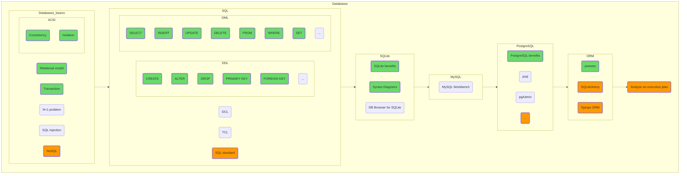

## Databases

Learn the general concepts first, and then the specifics of working with specific database management systems. Try working with SQLite, even if you're planning to switch to PostgreSQL later. SQLite is a very popular database, used in Android, Chromium and dozens of other popular projects. You can use SQLite as a convenient local storage alternative to working with files directly.

By the way, try to briefly return to chapter one, Data Structures, to understand how and why the inner workings of databases are structured.

This also provides yet another door into a "another world". Perhaps you would like to tie your future to databases by becoming a [DBA](https://en.wikipedia.org/wiki/Database_administrator)?

