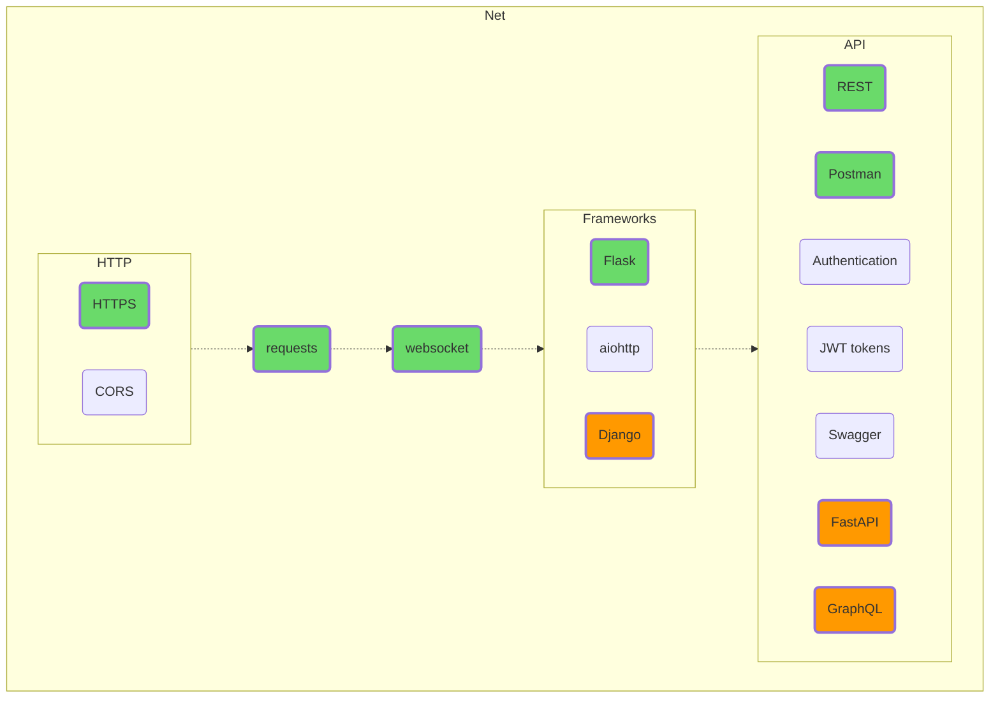

## Net

Try to create a client and a server, poke some popular website or an open API. Here you might as well experiment with HTML, CSS, and even Java(Type)Script. Who knows, perhaps your choice would be to become a full-stack programmer, combining back- and frontend development.

