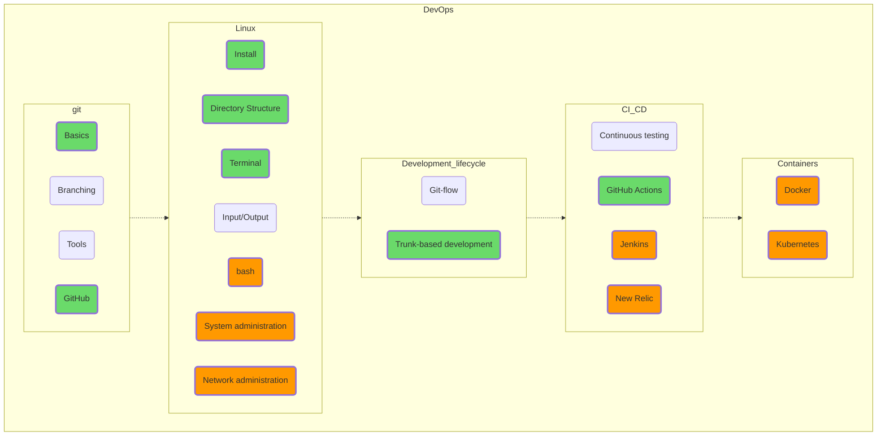

## Deployment and Administration

Despite the fact that git and especially Linux are quite complicated and extensive topics, the beginning of their learning curve isn't very steep, so I highly recommend starting your DevOps mastering with git (at least the add-commit-push part, so you at least have a revision history, flawed as it is) and Linux (PuTTY + WinSCP, for example; copy your Python scripts via SSH and run them on a remote Linux machine). Fortunately, these days good text and video tutorials covering these topics are about as rare as grains of sand on the beach.
Take it from me, the Linux console that looks so strange and inconvenient at first sight will seem much more familiar once you start learning vim. Cognition comes through comparison!

Well, this is where our map ends. Try to reach the last green section, GitHub Actions; run a linter on your open source project, for example (GitHub Actions is free for open source projects).

