## Общая диаграмма

Суммарную диаграмму мы получим простым механическим сложением предыдущих пунктов, просто чтобы вы могли посмотреть на то, что у нас в результате получилось. Финальные [Mermaid](https://github.com/amaargiru/pyroad/blob/main/13_Full.md), [svg](https://raw.githubusercontent.com/amaargiru/pyroad/main/pics_svg/13_Full.svg), [png](https://raw.githubusercontent.com/amaargiru/pyroad/main/pics_png/13_Full.png).

```mermaid
flowchart TD
Data_Structures ==> Data_Management ==> Data_Flows ==> OOP ==> Language_Skeleton ==> Multithreading_&_Multiprocessing ==> Common_Practice ==> Algorithms ==> Database ==> Net ==> Architecture ==> DevOps

subgraph Data_Structures
direction LR
List(list) -.-> Tuple -.-> Dict -.-> Set -.-> Array -.-> Linked_List -.->Tree -.-> Python_specific_data_structures

subgraph Tuple
direction LR
tuple(tuple)
namedtuple(namedtuple)
end

subgraph Dict
direction LR
dict(dict)
HashProblem("Hash collisions")
defaultdict(defaultdict)
Counter(Counter)
end

subgraph Set
direction LR
set(set)
FrozenSet("frozen set")
end

subgraph Array
direction LR
array(array)
bytes(bytes)
bytearray(bytearray)
end

subgraph Linked_List
direction LR
SinglyLinkedList("Singly linked list")
subgraph Doubly_Linked_List
direction LR
deque(deque)
Queue(Queue)
end
end

subgraph Tree
direction LR
tree(tree)
heap(heap)
B-tree(B-tree)
RedBlackTree("Red–black tree")
AVLTree("AVL tree")
trie(trie)
end

subgraph Python_specific_data_structures
direction LR
enum(enum)
range(range)
dataclass(dataclass)
struct(struct)
string(string)
datetime(datetime)
end
end

subgraph Data_Management
direction LR
slice(slice) -.-> Sorting -.-> Comprehension -.-> String_Management -.-> Datetime_Management -.-> bisect(bisect) -.-> Functools -.->File -.-> Data_Analysis -.-> Neural_Networks
subgraph Sorting
direction LR
sort(sort)
sorted(sorted)
end

subgraph Comprehension
direction LR
listcomprehension(list)
dictcomprehension(dict)
setcomprehension(set)
end

subgraph String_Management
direction LR
String_Built-in_Functions("Built-in functions")
regex(regex)
end

subgraph Datetime_Management
direction LR
encode(encode)
decode(decode)
dtmath(math)
end

subgraph Functools
direction LR
fmap(map)
ffilter(filter)
freduce(reduce)
fpartial(partial)
fmore(...)
end

subgraph File
direction LR
Read_Write("read/write")
Text_Binary("text/binary")
JSON(JSON)
Pickle("Pickle")
Protocol_Buffers("Protocol Buffers")
paths(paths)
end

subgraph Data_Analysis
direction LR
Data_Built-in_Functions("Built-in functions")
NumPy(NumPy)
Pandas(Pandas)
end

subgraph Neural_Networks
direction LR
TensorFlow(TensorFlow)
Keras(Keras)
end

end

subgraph Data_Flows
direction LR

itertools -.-> enumerate -.-> Generator -.-> Decorator -.-> Context_managers

subgraph itertools
direction LR

subgraph Infinite_Iterators
icount(count)
icycle(cycle)
irepeat(repeat)
end

subgraph Finite_Iterators
accumulate(accumulate)
chain(chain)
compress(compress)
dropwhile(dropwhile)
takewhile(takewhile)
fimore(...)
end

subgraph Combinatorics
product(product)
combinations(combinations)
permutations(permutations)
combinations_with_replacement(combinations_with_replacement)
end
end

enumerate(enumerate)

subgraph Generator
direction LR
yield("yield")
yield_from("yield from")
Generator_expression("Generator expression")
end

subgraph Decorator
direction LR
decorator(decorator)
LRUCache("LRU Cache")
param_decorator("Parameterized decorator")
end

subgraph Context_managers
direction LR
enter_exit_cm("__enter__, __exit__")
contextlib(contextlib)
end

end

subgraph OOP
direction LR
OOP_Base -.-> Duck_Types -.-> Iterable_Duck_Types -.-> Object_Copy -.->Inheritance -.-> Metaprogramming

subgraph OOP_Base
direction LR
oopBase1("init, repr, str")
oop_property("@property")
staticmethod("@staticmethod")
classmethod("@classmethod, cls, self")
slots(slots)
end

subgraph Duck_Types
direction LR
Comparable(Comparable)
Hashable(Hashable)
Sortable(Sortable)
Iterator(Iterator)
Callable(Callable)
dt_Context_Manager("Context Manager")
end

subgraph Iterable_Duck_Types
direction LR
Iterable(Iterable)
Collection(Collection)
Sequence(Sequence)
ABC_Sequence("ABC Sequence")
end

subgraph Object_Copy
direction LR
shallow("Shallow copy")
deep("Deep copy")
end

subgraph Inheritance
direction LR
objInheritance(Inheritance)
Multiple_Inheritance("Multiple Inheritance")
abstractmethod("@abstractmethod")
MRO(MRO)
Inheritance_of_slots("Slots' inheritance")
end

subgraph Metaprogramming
direction LR
Metaclass("Meta Class")
ABCMeta(ABCMeta)
Registry(Registry)
end

end

subgraph Language_Skeleton
direction LR
Garbage_Collector -.-> Exception -.-> Introspection -.-> Other

subgraph Garbage_Collector
direction LR
reference_counting("Reference counting")
garbage_collector("Garbage collector")
debug_objgraph("GC debug / objgraph")
pypygc("PyPy GC")
end

subgraph Exception
direction LR
exception_handling("Exception handling")
built_in_exceptions("Built-in exceptions")
exception_raising("Exception raising")
user_exception("User exceptions")
exception_object("Exception Object")
end

subgraph Introspection
direction LR
variables(variables)
attributes(attributes)
parameters(parameters)
end

subgraph Other
direction LR
GIL(GIL)
args_kwargs("*, *args, **kwargs")
lambda(lambda)
Closure(Closure)
Operator(Operator)
end

end

subgraph Multithreading_&_Multiprocessing
direction LR

Multithreading -.-> asyncio -.-> Multiprocessing -.->Synchronization

subgraph Multithreading
direction LR
Thread(Thread)
Thread_Pool_Executor("Thread pool executor")
Timer
end

subgraph asyncio
direction LR
subgraph High_level_API
sleep(sleep)
run(run)
create_task(create_task)
gather(gather)
hilapi_more("...")
end
subgraph asyncio_Queues
asQueue(Queue)
asPriorityQueue(PriorityQueue)
asLifoQueue(LifoQueue)
end
subgraph asyncio_Streams
StreamReader(StreamReader)
StreamWriter(StreamWriter)
end
subgraph Low_level_API
new_event_loop(new_event_loop)
run_forever(run_forever)
lowlapi_more("...")
end
end

subgraph Multiprocessing
direction LR
Pool(Pool)
Process(Process)
Pipe(Pipe)
Value(Value)
muArray(Array)
Manager(Manager)
Listener(Listener)
end

subgraph Synchronization
direction LR
Lock(Lock)
Event(Event)
Condition(Condition)
Semaphore(Semaphore)
BoundedSemaphore(BoundedSemaphore)
Barrier(Barrier)
end

end

subgraph Common_Practice
direction LR

Logging -.-> Profiling -.-> Random -.-> Input -.-> Print -.-> Cryptography -.-> Testing

subgraph Logging
direction LR
StreamHandler(StreamHandler)
ColoredFormatter(ColoredFormatter)
Log_formatting("Log formatting")
RotatingFileHandler(RotatingFileHandler)
TimedRotatingFileHandler(TimedRotatingFileHandler)
ELK_Stack("ELK Stack")
end

subgraph Profiling
direction LR
Stopwatch(Stopwatch)
perf_counter(perf_counter)
timeit
Call_Graph("Call Graph")
end

subgraph Random
direction LR
random_mod(random)
secrets(secrets)
end

subgraph Input
direction LR
input(input)
Command_Line_Arguments("Command Line Arguments")
Argument_Parser("Argument Parser")
end

subgraph Print
direction LR
simple_print(print)
json_print("json.dumps")
Pretty_Print(pprint)
end

subgraph Cryptography
direction LR
MD5(MD5)
AES(AES)
cryptomore("...")
end

subgraph Testing
direction LR
pytest(pytest)
mock(mock)
end

end

subgraph Algorithms
direction LR
FizzBuzz -.-> bigo -.-> Sort -.-> Graphs -.-> Search -.-> Methods
Recursion ==> Recursion

FizzBuzz(FizzBuzz)
bigo("O(n)")

subgraph Sort
direction LR
BubbleSort(BubbleSort)
QuickSort(QuickSort)
MergeSort(MergeSort)
HeapSort(HeapSort)
InsertionSort(InsertionSort)
RadixSort(RadixSort)
end

subgraph Graphs
direction LR
Adjacency_Matrix("Adjacency matrix")
Incidence_Matrix("Incidence matrix")
Adjacency_List("Adjacency list")
Incidence_List("Incidence list")
end

subgraph Search
direction LR
Linear_Search("Linear search")
Binary_Search("Binary search")
DFS(DFS)
BFS(BFS)
Dijkstras(Dijkstras)
Bellman_Ford("Bellman–Ford")
end

subgraph Methods
direction LR
divide_and_conquer("Divide and conquer")
Dynamic_programming("Dynamic programming")
Greedy_algorithm("Greedy algorithm")
Recursion(Recursion)
methmore("...")
end

end

subgraph Database
direction LR

Database_basics -.-> SQL -.-> SQLite -.-> MySQL -.-> PostgreSQL -.-> ORM -.-> Analyze_an_execution_plan

subgraph Database_basics
direction LR
Relational_model("Relational model")
Transaction(Transaction)
subgraph ACID
Consistency(Consistency)
Isolation(Isolation)
end
Nplusone("N+1 problem")
SQL_injection("SQL injection")
NoSQL(NoSQL)
end

subgraph SQL
direction LR

subgraph DDL
CREATE(CREATE)
ALTER(ALTER)
DROP(DROP)
PRIMARY_KEY("PRIMARY KEY")
FOREIGN_KEY("FOREIGN KEY")
ddlmore("...")
end

subgraph DML
SELECT(SELECT)
INSERT(INSERT)
UPDATE(UPDATE)
DELETE(DELETE)
FROM(FROM)
WHERE(WHERE)
SET(SET)

dmlmore("...")
end

DCL(DCL)
TCL(TCL)
SQL_standard("SQL standard")

end

subgraph SQLite
direction LR
SQLite_benefits("SQLite benefits")
Syntax_Diagrams("Syntax Diagrams")
DB_Browser_for_SQLite("DB Browser for SQLite")
end

subgraph MySQL
direction LR
MySQL_Workbench("MySQL Workbench")
end

subgraph PostgreSQL
direction LR
PostgreSQL_benefits("PostgreSQL benefits")
psql(psql)
pgAdmin(pgAdmin)
PostgreSQL_more("...")
end

subgraph ORM
direction LR
peewee(peewee)
SQLAlchemy(SQLAlchemy)
Django_ORM("Django ORM")
end

Analyze_an_execution_plan("Analyze an execution plan")

end

subgraph Net
direction LR
HTTP -.-> requests -.-> websocket -.-> Frameworks -.-> API

subgraph HTTP
direction LR
HTTPS(HTTPS)
CORS(CORS)
end

requests(requests)
websocket(websocket)

subgraph Frameworks
direction LR
aiohttp(aiohttp)
Flask(Flask)
Django(Django)
end

subgraph API
direction LR
REST(REST)
Authentication(Authentication)
jwt_tokens("JWT tokens")
Swagger(Swagger)
FastAPI(FastAPI)
end

end

subgraph Architecture
direction LR
WhatIsArch -.-> Principles -.-> Paradigms -.-> Object-oriented -.-> Design_Patterns -.-> Microservices -.-> System_Design -.-> Practices

WhatIsArch("What is?")
subgraph Principles
direction LR

subgraph SOLID
SRP(SRP)
OCP(OCP)
LSP(LSP)
ISP(ISP)
DIP(DIP)
end

coupling_vs_cohesion("Coupling vs cohesion")
KISS(KISS)
DRY(DRY)
YAGNI(YAGNI)

end

subgraph Paradigms
direction LR
Procedural(Procedural)
Structured(Structured)
parObject-oriented(Object-oriented)
Functional(Functional)
end

subgraph Object-oriented
direction LR
ooInheritance(Inheritance)
Encapsulation(Encapsulation)
Polymorphism(Polymorphism)
Abstraction(Abstraction)
end

subgraph Microservices
direction LR

Decentralization(Decentralization)
Smart_endpoints_dumb_pipes("Smart endpoints, dumb pipes")
Design_for_failure("Design for failure")

subgraph Messaging
direction LR
RabbitMQ(RabbitMQ)
Apache_Kafka("Apache Kafka")
end
end

subgraph Design_Patterns
direction LR

Observer(Observer)
Decorator_Method(Decorator)
Factory_Method("Factory Method")
Adapter_Facade("Adapter, Facade")

Creational_patterns("Creational patterns")
Structural_patterns("Structural patterns")
Behavioral_patterns("Behavioral patterns")
end

subgraph System_Design
direction LR
CQRS(CQRS)
Two_Phase_Commit("Two-Phase Commit")
Load_Balanced_Services("Load-Balanced Services")
Pattern_of_Distributed_Systems("Patterns of Distributed Systems")
Cloud_Design_Patterns("Cloud Design Patterns")
end

subgraph Practices
direction LR
Agile(Agile)
Scrum(Scrum)
Kanban(Kanban)
end

end

subgraph DevOps
direction LR
git -.-> Linux -.-> Development_lifecycle -.-> CI_CD -.-> Containers

subgraph git
direction LR
Basics(Basics)
Branching(Branching)
Tools(Tools)
GitHub(GitHub)
end

subgraph Linux
direction LR
Install(Install)
Directory_Structure("Directory Structure")
Terminal(Terminal)
Input_Output("Input/Output")
bash(bash)
System_administration("System administration")
Network_administration("Network administration")
end

subgraph Development_lifecycle
direction LR
Git_flow("Git-flow")
trunk_based_development("Trunk-based development")
end

subgraph CI_CD
direction LR
Continuous_testing("Continuous testing")
GitHub_Actions("GitHub Actions")
Jenkins(Jenkins)
New_Relic("New Relic")
end

subgraph Containers
direction LR
Docker(Docker)
Kubernetes(Kubernetes)
end

end

classDef trainee fill:#6ADA6A, stroke-width:3px
classDef middle fill:#FF9900, stroke-width:3px

class List trainee;
class tuple trainee;
class dict trainee;
class set trainee;
class array trainee;
class bytes trainee;
class deque trainee;
class heap trainee;
class range trainee;
class string trainee;
class datetime trainee;
class slice trainee;
class sort trainee;
class sorted trainee;
class listcomprehension trainee;
class bisect trainee;
class fmap trainee;
class ffilter trainee;
class freduce trainee;
class String_Built-in_Functions trainee;
class encode trainee;
class decode trainee;
class Read_Write trainee;
class Text_Binary trainee;
class JSON trainee;
class paths trainee;
class Data_Built-in_Functions trainee;
class icount trainee;
class icycle trainee;
class irepeat trainee;
class product trainee;
class combinations trainee;
class enumerate trainee;
class yield trainee;
class decorator trainee;
class enter_exit_cm trainee;
class oopBase1 trainee;
class oop_property trainee;
class staticmethod trainee;
class classmethod trainee;
class slots trainee;
class Comparable trainee;
class Hashable trainee;
class Sortable trainee;
class Iterable trainee;
class Collection trainee;
class shallow trainee;
class deep trainee;
class objInheritance trainee;
class Multiple_Inheritance trainee;
class MRO trainee;
class reference_counting trainee;
class garbage_collector trainee;
class GIL trainee;
class args_kwargs trainee;
class lambda trainee;
class exception_handling trainee;
class built_in_exceptions trainee;
class exception_raising trainee;
class create_task trainee;
class gather trainee;
class sleep trainee;
class run trainee;
class wait_for trainee;
class asQueue trainee;
class Lock trainee;
class Event trainee;
class variables trainee;
class Thread trainee;
class Pool trainee;
class Stopwatch trainee;
class timeit trainee;
class random_mod trainee;
class input trainee;
class Command_Line_Arguments trainee;
class simple_print trainee;
class MD5 trainee;
class AES trainee;
class pytest trainee;
class FizzBuzz trainee;
class BubbleSort trainee;
class QuickSort trainee;
class RadixSort trainee;
class Adjacency_Matrix trainee;
class Adjacency_List trainee;
class Linear_Search trainee;
class Binary_Search trainee;
class DFS trainee;
class bigo trainee;
class divide_and_conquer trainee;
class Greedy_algorithm trainee;
class Recursion trainee;
class Relational_model trainee;
class Transaction trainee;
class Isolation trainee;
class PostgreSQL_benefits trainee;
class peewee trainee;
class CREATE trainee;
class ALTER trainee;
class DROP trainee;
class SELECT trainee;
class INSERT trainee;
class UPDATE trainee;
class DELETE trainee;
class PRIMARY_KEY trainee;
class FOREIGN_KEY trainee;
class FROM trainee;
class WHERE trainee;
class SET trainee;
class SQLite_benefits trainee;
class Syntax_Diagrams trainee;
class Flask trainee;
class Consistency trainee;
class HTTPS trainee;
class requests trainee;
class websocket trainee;
class GitHub_Actions trainee;
class WhatIsArch trainee;
class SRP trainee;
class OCP trainee;
class LSP trainee;
class ISP trainee;
class DIP trainee;
class coupling_vs_cohesion trainee;
class Procedural trainee;
class parObject-oriented trainee;
class ooInheritance trainee;
class Encapsulation trainee;
class Polymorphism trainee;
class Abstraction trainee;
class trunk_based_development trainee;
class aiohttp trainee;
class StreamHandler trainee;
class Observer trainee;
class Decorator_Method trainee;
class Factory_Method trainee;
class Adapter_Facade trainee;
class CQRS trainee;
class Decentralization trainee;
class Smart_endpoints_dumb_pipes trainee;
class Basics trainee;
class GitHub trainee;
class Install trainee;
class Directory_Structure trainee;
class Terminal trainee;
class accumulate trainee;
class chain trainee;
class compress trainee;
class dropwhile trainee;
class takewhile trainee;

class bash middle;
class System_administration middle;
class Network_administration middle;
class NoSQL middle;
class Functional middle;
class RabbitMQ middle;
class Scrum middle;
class Apache_Kafka middle;
class Docker middle;
class methmore middle;
class PostgreSQL_more middle;
class SQLAlchemy middle;
class Django_ORM middle;
class Django middle;
class FastAPI middle;
class SQL_standard middle;
class Analyze_an_execution_plan middle;
class TensorFlow middle;
class Keras middle;
class cryptomore middle;
class Jenkins middle;
class Kubernetes middle;
class Creational_patterns middle;
class Structural_patterns middle;
class Behavioral_patterns middle;
class Architectural_Patterns middle;
class ELK_Stack middle;
class Pattern_of_Distributed_Systems middle;
class Cloud_Design_Patterns middle;
class New_Relic middle;
```

