## Detailed Python developer roadmap

  

Hello! My name is Mikhail Emelyanov, I am embedded software engineer, and I was inspired to write this little roadmap on the capabilities of Python language by a certain commonality among the existing Python tutorials found on the web.

The usual suggestions to study, say, “Algorithms and Data Structures” or “Databases” are especially jarring. You can spend years studying these topics, and even after decades you'd still be able to find something you didn't know yet even without ever venturing outside the scope of Algorithms!

Using video game analogies, we can say that novice programmers often stand on the shore of the lake of boiling lava with an island with the ever-coveted jobs in the center, while the islands in between, which you have to jump on, gradually increasing your skills in successive mini-quests, are either missing, or arranged haphazardly, or their fairly smooth sequence breaks off, never having managed to get you any farther from the shore. Let's try to build a path of hint islands, a number of which, although not without effort, will finally allow us to reach our goal.

The roadmap is very easy to use. Just as you would in a normal text, go from left to right and from top to bottom. If you're just starting to learn Python, follow the green sections of the roadmap. If your accumulated experience, curiosity, or necessity pushes you deeper, start exploring the sections marked in gray. Orange marks the topics that require in-depth study, those are better to tackle (at least without digging especially deep to begin with) on the third pass.

This article definitely contains mistakes and inaccuracies of different calibers, and of course, many required subsections are missing; so, if you notice any of these, feel free to comment, and if you feel the Force, you're welcome to fork the [GitHub repository](https://github.com/amaargiru/pyroad) with the roadmap's source code and contribute whatever you feel is necessary; all corrections and additions are strongly encouraged. It also contains all the parts of the map in [Mermaid](https://github.blog/2022-02-14-include-diagrams-markdown-files-mermaid/) diagram format, as well as png/svg illustrations.

When diving into Python, don't forget the excellent official documentation at [docs.python.org](https://docs.python.org/). By studying it, at least in brief, and gradually reading deeper into the right sections, you will be able to see that many of the “hacks”, “findings” and other obscure matters have long since been considered, described and have detailed examples of use.

I would also recommend [leetcode.com](https://leetcode.com/problemset/all/?difficulty=EASY&page=1&status=NOT_STARTED) for learning basic Python syntax to the fullest extent. If you filter the tasks by “Easy” level, and then add an additional sorting by the “Acceptance” column, you'll be presented with a straightforward primer with smoothly increasing task difficulty, rather than the intimidating competitive platform.

Well, that’s enough stalling for the moment. Let's get started! 
## Data Structures

As a reminder, if you are a novice developer, go from left to right through the entries marked in green. Create instances of each type, try adding and removing elements, and experiment with them via the debugger. See how big the resulting objects are, and try to figure out why list and array containing the same data are different in size. Study the features of each type, read and figure out which data structure will work best for which tasks.

Don't forget that this is just a guide, a table of contents for a book that you will have to write yourself. Actively seek information on the web, consult sources and official documentation. Dive [Stackoverflow](https://stackoverflow.com/) just for fun, there's plenty of exciting reading there!

If you start to make progress, move on to the next section, and don't feel bad if you can't. Don't envision your mind as the sword of Alexander the Great cutting the Gordian knot in one fluid, precise move, worthy of Instagram's front page. Be as a carpenter’s plane, stripping away one thin layer at a time, and sooner or later the misunderstanding will go away, even if this seems to you to be a chasm ten thousand leagues deep.

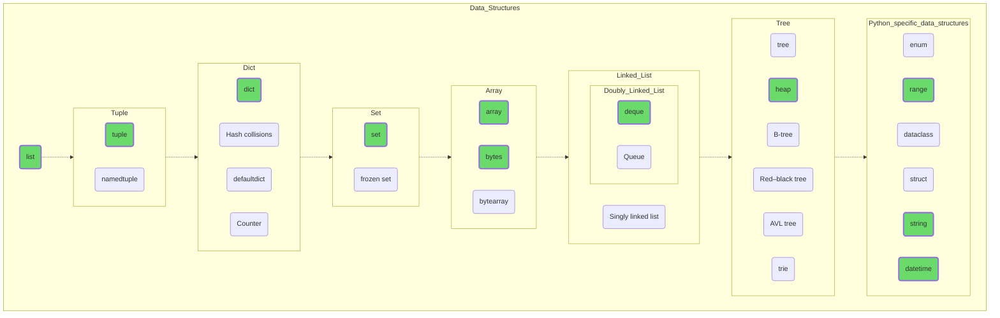
## Data Management

Try to manipulate your data, feel how you can mold anything you want out of this malleable clay. Try creating a data structure with many elements (a million, for example), sort them, quickly find the values you want with bisect, and write the results in a JSON file.

If everything goes according to plan, try to dig into the less obvious topics: apply regex to solve some simple task or save previously obtained data in Pickle format, understanding the reason for binary file formats after observing the size of the resulting files.

This is where you will find the first entries marked in orange. Google what TensorFlow and Keras are and what tasks they solve. Perhaps, this could be your future job, your vocation!

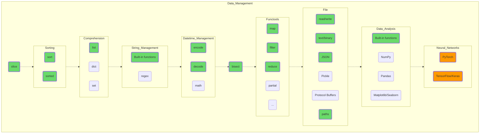
## Data Flows

Add more specific capabilities to your data management skills. All of the topics covered are essential in the practical programming process and are present in all modern languages in one form or another. That way, if you eventually switch from Python to Java, C# or C++, the knowledge you've acquired won't become dead weight.

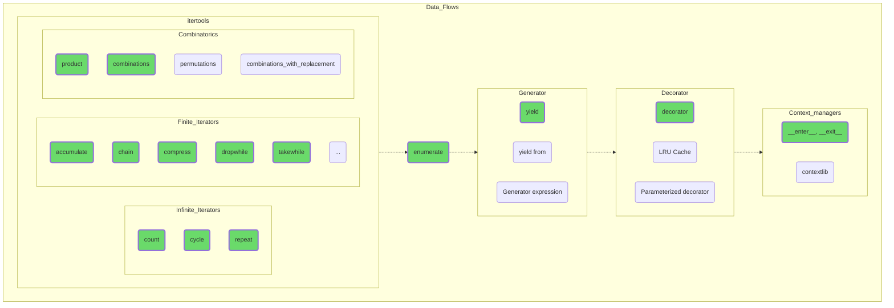
## Object-Oriented Programming

Dive into the subject of object-oriented programming. Understand that objects are your friends, and all their features and properties, even if they are not quite intuitive at first glance, have purely utilitarian reasons for existing.

OOP makes it much easier to partition, develop and maintain code, not just making very complex tasks feasible for average programmers, but making the world around us more manageable, predictable and generally better.

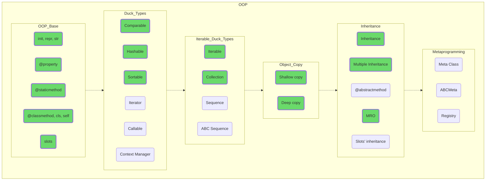
## Language Skeleton

Perfect, a bit deeper now. Studying how GIL or GC works will give you an understanding of why things go awry in one case or another, not at all the way you planned. You are likely to use exceptions all the time, given that they can occur in some operations with data structures, so study them further.

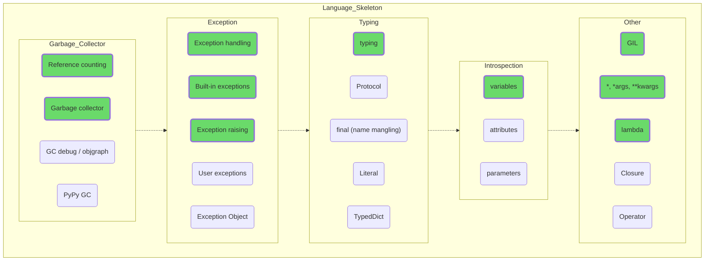
## Multithreading and Multiprocessing

Before you dive into multithreading and multiprocessing, be sure to study their typical use cases. There may be situations in which the gain is minimal or non-existent.

Try to implement simultaneous fast data processing and waiting for user input, which changes the input data for calculations, so you understand the capabilities, pros and cons of different approaches.

Don't try to use all the features provided by Python at once, stick to the task at hand.

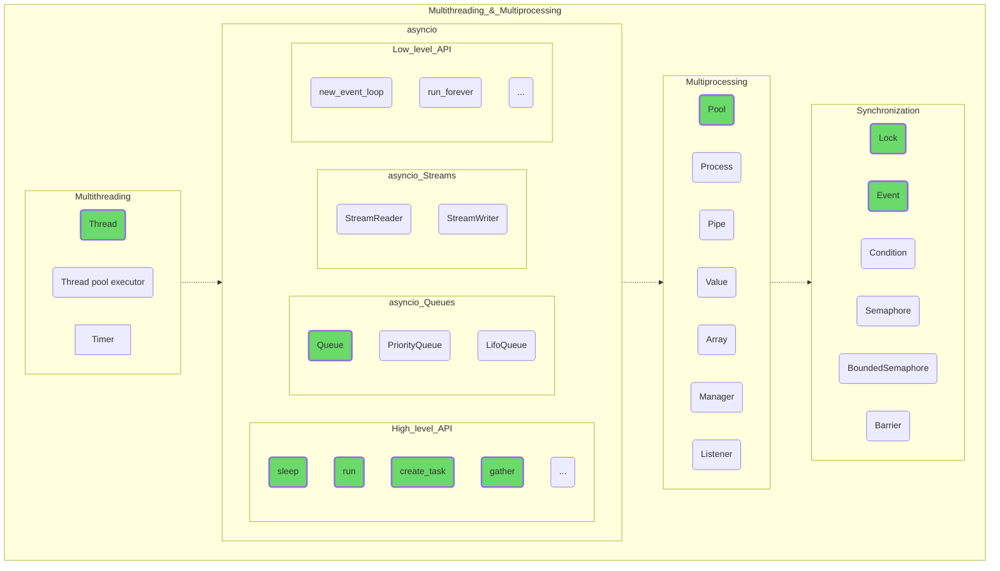
## Common Practices

Description of common methods used in almost all software projects, not just in Python. I/O, profiling, and logging apply universally.

Testing in general constitutes a separate profession, and often the quality of a software product can be judged by the test coverage of the source code. For example, the code of the SQLite database is 100% [covered by tests](https://www.sqlite.org/testing.html), while one line of "combative" code requires 608 lines of tests.  
Jokes aside, projects with 100% coverage are not common, but pytest used wisely is the best guarantor of your sound sleep at night!

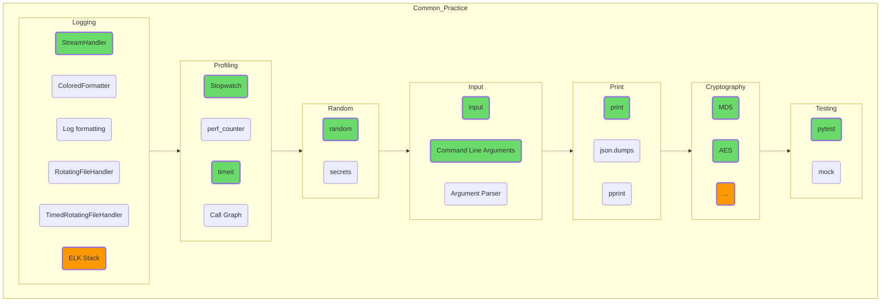
## Algorithms

One of those areas of human knowledge that you can delve into endlessly. On the other hand, the learning curve of this discipline for covering the practical needs of the average programmer has long been known, so the initial stages shouldn't be too difficult for you. Who knows, maybe you'll enjoy it so much and drag it out that in time you might even be able to contribute a new robust argument in the discussion of “[Equality of P and NP classes](https://en.wikipedia.org/wiki/P_versus_NP_problem)”!

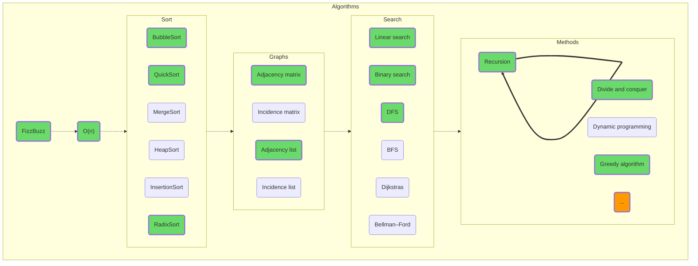
## Databases

Learn the general concepts first, and then the specifics of working with specific database management systems. Try working with SQLite, even if you're planning to switch to PostgreSQL later. SQLite is a very popular database, used in Android, Chromium and dozens of other popular projects. You can use SQLite as a convenient local storage alternative to working with files directly.

By the way, try to briefly return to chapter one, Data Structures, to understand how and why the inner workings of databases are structured.

This also provides yet another door into a "another world". Perhaps you would like to tie your future to databases by becoming a [DBA](https://en.wikipedia.org/wiki/Database_administrator)?

```mermaid
flowchart TD

subgraph Database
direction LR

Database_basics -.-> SQL -.-> SQLite -.-> MySQL -.-> PostgreSQL -.-> ORM -.-> Analyze_an_execution_plan

subgraph Database_basics
direction LR
Relational_model("Relational model")
Transaction(Transaction)
subgraph ACID
Consistency(Consistency)
Isolation(Isolation)
end
Nplusone("N+1 problem")
SQL_injection("SQL injection")
NoSQL(NoSQL)
end

subgraph SQL
direction LR

subgraph DDL
CREATE(CREATE)
ALTER(ALTER)
DROP(DROP)
PRIMARY_KEY("PRIMARY KEY")
FOREIGN_KEY("FOREIGN KEY")
ddlmore("...")
end

subgraph DML
SELECT(SELECT)
INSERT(INSERT)
UPDATE(UPDATE)
DELETE(DELETE)
FROM(FROM)
WHERE(WHERE)
SET(SET)

dmlmore("...")
end

DCL(DCL)
TCL(TCL)
SQL_standard("SQL standard")

end

subgraph SQLite
direction LR
SQLite_benefits("SQLite benefits")
Syntax_Diagrams("Syntax Diagrams")
DB_Browser_for_SQLite("DB Browser for SQLite")
end

subgraph MySQL
direction LR
MySQL_Workbench("MySQL Workbench")
end

subgraph PostgreSQL
direction LR
PostgreSQL_benefits("PostgreSQL benefits")
psql(psql)
pgAdmin(pgAdmin)
PostgreSQL_more("...")
end

subgraph ORM
direction LR
peewee(peewee)
SQLAlchemy(SQLAlchemy)
Django_ORM("Django ORM")
end

Analyze_an_execution_plan("Analyze an execution plan")

end
classDef trainee fill:#6ADA6A, stroke-width:3px
classDef middle fill:#FF9900, stroke-width:3px

class List trainee;
class tuple trainee;
class dict trainee;
class set trainee;
class array trainee;
class bytes trainee;
class deque trainee;
class heap trainee;
class range trainee;
class string trainee;
class datetime trainee;
class slice trainee;
class sort trainee;
class sorted trainee;
class listcomprehension trainee;
class bisect trainee;
class fmap trainee;
class ffilter trainee;
class freduce trainee;
class String_Built-in_Functions trainee;
class encode trainee;
class decode trainee;
class Read_Write trainee;
class Text_Binary trainee;
class JSON trainee;
class paths trainee;
class Data_Built-in_Functions trainee;
class icount trainee;
class icycle trainee;
class irepeat trainee;
class pairwise trainee;
class product trainee;
class combinations trainee;
class enumerate trainee;
class generator trainee;
class decorator trainee;
class context trainee;
class oopBase1 trainee;
class oop_property trainee;
class staticmethod trainee;
class classmethod trainee;
class slots trainee;
class Comparable trainee;
class Hashable trainee;
class Sortable trainee;
class Iterable trainee;
class Collection trainee;
class shallow trainee;
class deep trainee;
class objInheritance trainee;
class Multiple_Inheritance trainee;
class MRO trainee;
class reference_counting trainee;
class garbage_collector trainee;
class GIL trainee;
class args_kwargs trainee;
class lambda trainee;
class exception_handling trainee;
class built_in_exceptions trainee;
class exception_raising trainee;
class create_task trainee;
class gather trainee;
class wait_for trainee;
class asQueue trainee;
class Lock trainee;
class Event trainee;
class variables trainee;
class Thread trainee;
class Pool trainee;
class Logging trainee;
class Stopwatch trainee;
class timeit trainee;
class Random trainee;
class input trainee;
class Command_Line_Arguments trainee;
class simple_print trainee;
class MD5 trainee;
class AES trainee;
class pytest trainee;
class FizzBuzz trainee;
class BubbleSort trainee;
class QuickSort trainee;
class RadixSort trainee;
class Adjacency_Matrix trainee;
class Adjacency_List trainee;
class Linear_Search trainee;
class Binary_Search trainee;
class DFS trainee;
class bigo trainee;
class divide_and_conquer trainee;
class Greedy_algorithm trainee;
class Recursion trainee;
class Relational_model trainee;
class Transaction trainee;
class Isolation trainee;
class PostgreSQL_benefits trainee;
class peewee trainee;
class CREATE trainee;
class ALTER trainee;
class DROP trainee;
class SELECT trainee;
class INSERT trainee;
class UPDATE trainee;
class DELETE trainee;
class PRIMARY_KEY trainee;
class FOREIGN_KEY trainee;
class FROM trainee;
class WHERE trainee;
class SET trainee;
class SQLite_benefits trainee;
class Syntax_Diagrams trainee;
class Flask trainee;
class Consistency trainee;
class HTTPS trainee;
class requests trainee;
class websocket trainee;
class GitHub_Actions trainee;
class WhatIsArch trainee;
class SRP trainee;
class OCP trainee;
class LSP trainee;
class ISP trainee;
class DIP trainee;
class coupling_vs_cohesion trainee;
class Procedural trainee;
class parObject-oriented trainee;
class ooInheritance trainee;
class Encapsulation trainee;
class Polymorphism trainee;
class Abstraction trainee;
class trunk_based_development trainee;
class aiohttp trainee;

class NoSQL middle;
class Functional middle;
class RabbitMQ middle;
class Scrum middle;
class Apache_Kafka middle;
class git middle;
class Linux middle;
class Docker middle;
class methmore middle;
class PostgreSQL_more middle;
class SQLAlchemy middle;
class Django_ORM middle;
class Django middle;
class FastAPI middle;
class SQL_standard middle;
class Analyze_an_execution_plan middle;
class TensorFlow middle;
class Keras middle;
class cryptomore middle;
class Jenkins middle;
class Kubernetes middle;
class Architectural_Patterns middle;
```
## Net

Try to create a client and a server, poke some popular website or an open API. Here you might as well experiment with HTML, CSS, and even Java(Type)Script. Who knows, perhaps your choice would be to become a full-stack programmer, combining back- and frontend development.

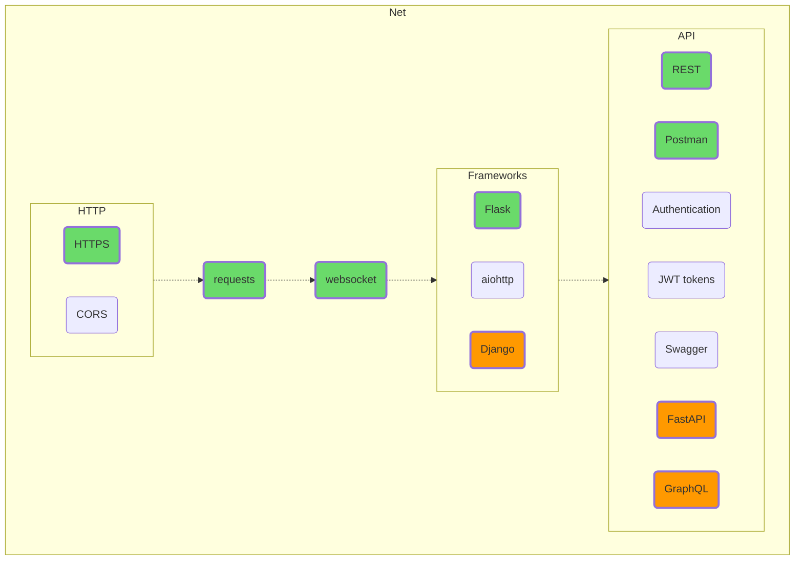
## Architecture

Please try not to memorize architectural principles by heart; they are not Shakespeare's timeless poems. The rambling about how “Liskov's substitution principle means that if S is a subtype of T, then objects of type T in a program can be...” offers no advantage to anyone.
Just try applying the same LSP to the program you are writing. What benefit would compliance with this principle give you? What problems will result from not following it? What price will you have to pay for its implementation and support?

Try messing around with the functional paradigm. Applying the functional approach and using it in practice is possible not only in Haskell or F#, but also in Python, and it doesn't have to be done only within functools.

Figure out the reasoning behind the job interviewer's request to “say the three main words” (it's not “I love you”, by the way, it’s “inheritance, encapsulation, polymorphism”) and why this triad should be supplemented with the “abstraction”.

Try to understand what specific, tangible problems of the old paradigms the developers of Agile or the popularizers of microservice architecture faced. Figure out what's wrong with main(), which calls all the other procedures, since this is common practice in embedded programming. Weigh the cost of additional layers of abstraction between the root business logic and the outside world.

```mermaid
flowchart TD

subgraph Architecture
direction LR
WhatIsArch -.-> Principles -.-> Paradigms -.-> Object-oriented -.-> Design_Patterns -.-> Microservices -.-> System_Design -.-> Practices

WhatIsArch("What is?")
subgraph Principles
direction LR

subgraph SOLID
SRP(SRP)
OCP(OCP)
LSP(LSP)
ISP(ISP)
DIP(DIP)
end

coupling_vs_cohesion("Coupling vs cohesion")
KISS(KISS)
DRY(DRY)
YAGNI(YAGNI)

end

subgraph Paradigms
direction LR
Procedural(Procedural)
Structured(Structured)
parObject-oriented(Object-oriented)
Functional(Functional)
end

subgraph Object-oriented
direction LR
ooInheritance(Inheritance)
Encapsulation(Encapsulation)
Polymorphism(Polymorphism)
Abstraction(Abstraction)
end

subgraph Microservices
direction LR

Decentralization(Decentralization)
Smart_endpoints_dumb_pipes("Smart endpoints, dumb pipes")
Design_for_failure("Design for failure")

subgraph Messaging
direction LR
RabbitMQ(RabbitMQ)
Apache_Kafka("Apache Kafka")
end
end

subgraph Design_Patterns
direction LR

Observer(Observer)
Decorator_Method(Decorator)
Factory_Method("Factory Method")
Adapter_Facade("Adapter, Facade")

Creational_patterns("Creational patterns")
Structural_patterns("Structural patterns")
Behavioral_patterns("Behavioral patterns")
end

subgraph System_Design
direction LR
CQRS(CQRS)
Two_Phase_Commit("Two-Phase Commit")
Load_Balanced_Services("Load-Balanced Services")
Pattern_of_Distributed_Systems("Patterns of Distributed Systems")
Cloud_Design_Patterns("Cloud Design Patterns")
end

subgraph Practices
direction LR
Agile(Agile)
Scrum(Scrum)
Kanban(Kanban)
end

end

classDef trainee fill:#6ADA6A, stroke-width:3px
classDef middle fill:#FF9900, stroke-width:3px

class List trainee;
class tuple trainee;
class dict trainee;
class set trainee;
class array trainee;
class bytes trainee;
class deque trainee;
class heap trainee;
class range trainee;
class string trainee;
class datetime trainee;
class slice trainee;
class sort trainee;
class sorted trainee;
class listcomprehension trainee;
class bisect trainee;
class fmap trainee;
class ffilter trainee;
class freduce trainee;
class String_Built-in_Functions trainee;
class encode trainee;
class decode trainee;
class Read_Write trainee;
class Text_Binary trainee;
class JSON trainee;
class paths trainee;
class Data_Built-in_Functions trainee;
class icount trainee;
class icycle trainee;
class irepeat trainee;
class pairwise trainee;
class product trainee;
class combinations trainee;
class enumerate trainee;
class generator trainee;
class decorator trainee;
class context trainee;
class oopBase1 trainee;
class oop_property trainee;
class staticmethod trainee;
class classmethod trainee;
class slots trainee;
class Comparable trainee;
class Hashable trainee;
class Sortable trainee;
class Iterable trainee;
class Collection trainee;
class shallow trainee;
class deep trainee;
class objInheritance trainee;
class Multiple_Inheritance trainee;
class MRO trainee;
class reference_counting trainee;
class garbage_collector trainee;
class GIL trainee;
class args_kwargs trainee;
class lambda trainee;
class exception_handling trainee;
class built_in_exceptions trainee;
class exception_raising trainee;
class create_task trainee;
class gather trainee;
class sleep trainee;
class run trainee;
class wait_for trainee;
class asQueue trainee;
class Lock trainee;
class Event trainee;
class variables trainee;
class Thread trainee;
class Pool trainee;
class Stopwatch trainee;
class timeit trainee;
class random_mod trainee;
class input trainee;
class Command_Line_Arguments trainee;
class simple_print trainee;
class MD5 trainee;
class AES trainee;
class pytest trainee;
class FizzBuzz trainee;
class BubbleSort trainee;
class QuickSort trainee;
class RadixSort trainee;
class Adjacency_Matrix trainee;
class Adjacency_List trainee;
class Linear_Search trainee;
class Binary_Search trainee;
class DFS trainee;
class bigo trainee;
class divide_and_conquer trainee;
class Greedy_algorithm trainee;
class Recursion trainee;
class Relational_model trainee;
class Transaction trainee;
class Isolation trainee;
class PostgreSQL_benefits trainee;
class peewee trainee;
class CREATE trainee;
class ALTER trainee;
class DROP trainee;
class SELECT trainee;
class INSERT trainee;
class UPDATE trainee;
class DELETE trainee;
class PRIMARY_KEY trainee;
class FOREIGN_KEY trainee;
class FROM trainee;
class WHERE trainee;
class SET trainee;
class SQLite_benefits trainee;
class Syntax_Diagrams trainee;
class Flask trainee;
class Consistency trainee;
class HTTPS trainee;
class requests trainee;
class websocket trainee;
class GitHub_Actions trainee;
class WhatIsArch trainee;
class SRP trainee;
class OCP trainee;
class LSP trainee;
class ISP trainee;
class DIP trainee;
class coupling_vs_cohesion trainee;
class Procedural trainee;
class parObject-oriented trainee;
class ooInheritance trainee;
class Encapsulation trainee;
class Polymorphism trainee;
class Abstraction trainee;
class trunk_based_development trainee;
class aiohttp trainee;
class StreamHandler trainee;
class Observer trainee;
class Decorator_Method trainee;
class Factory_Method trainee;
class Adapter_Facade trainee;
class CQRS trainee;
class Decentralization trainee;
class Smart_endpoints_dumb_pipes trainee;

class NoSQL middle;
class Functional middle;
class RabbitMQ middle;
class Scrum middle;
class Apache_Kafka middle;
class git middle;
class Linux middle;
class Docker middle;
class methmore middle;
class PostgreSQL_more middle;
class SQLAlchemy middle;
class Django_ORM middle;
class Django middle;
class FastAPI middle;
class SQL_standard middle;
class Analyze_an_execution_plan middle;
class TensorFlow middle;
class Keras middle;
class cryptomore middle;
class Jenkins middle;
class Kubernetes middle;
class Creational_patterns middle;
class Structural_patterns middle;
class Behavioral_patterns middle;
class Architectural_Patterns middle;
class ELK_Stack middle;
class Pattern_of_Distributed_Systems middle;
class Cloud_Design_Patterns middle;
```
## Deployment and Administration

Despite the fact that git and especially Linux are quite complicated and extensive topics, the beginning of their learning curve isn't very steep, so I highly recommend starting your DevOps mastering with git (at least the add-commit-push part, so you at least have a revision history, flawed as it is) and Linux (PuTTY + WinSCP, for example; copy your Python scripts via SSH and run them on a remote Linux machine). Fortunately, these days good text and video tutorials covering these topics are about as rare as grains of sand on the beach.
Take it from me, the Linux console that looks so strange and inconvenient at first sight will seem much more familiar once you start learning vim. Cognition comes through comparison!

Well, this is where our map ends. Try to reach the last green section, GitHub Actions; run a linter on your open source project, for example (GitHub Actions is free for open source projects).

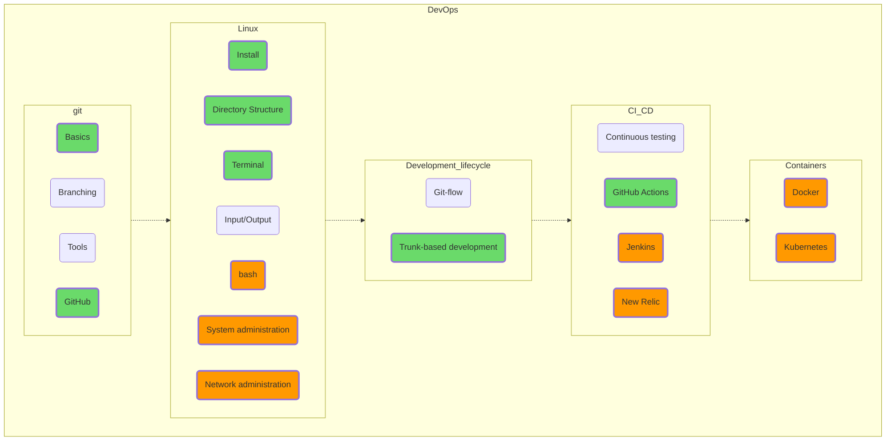
## Overall Roadmap

The overall roadmap can be obtained by simply mechanically adding up the previous entries, just so we can see what we've ended up with. Overall [Mermaid](https://github.com/amaargiru/pyroad/blob/main/13_Full.md), [svg](https://raw.githubusercontent.com/amaargiru/pyroad/main/pics_svg/13_Full.svg), [png](https://raw.githubusercontent.com/amaargiru/pyroad/main/pics_png/13_Full.png).

```mermaid
flowchart TD
Data_Structures ==> Data_Management ==> Data_Flows ==> OOP ==> Language_Skeleton ==> Multithreading_&_Multiprocessing ==> Common_Practice ==> Algorithms ==> Database ==> Net ==> Architecture ==> DevOps

subgraph Data_Structures
direction LR
List(list) -.-> Tuple -.-> Dict -.-> Set -.-> Array -.-> Linked_List -.->Tree -.-> Python_specific_data_structures

subgraph Tuple
direction LR
tuple(tuple)
namedtuple(namedtuple)
end

subgraph Dict
direction LR
dict(dict)
HashProblem("Hash collisions")
defaultdict(defaultdict)
Counter(Counter)
end

subgraph Set
direction LR
set(set)
FrozenSet("frozen set")
end

subgraph Array
direction LR
array(array)
bytes(bytes)
bytearray(bytearray)
end

subgraph Linked_List
direction LR
SinglyLinkedList("Singly linked list")
subgraph Doubly_Linked_List
direction LR
deque(deque)
Queue(Queue)
end
end

subgraph Tree
direction LR
tree(tree)
heap(heap)
B-tree(B-tree)
RedBlackTree("Red–black tree")
AVLTree("AVL tree")
trie(trie)
end

subgraph Python_specific_data_structures
direction LR
enum(enum)
range(range)
dataclass(dataclass)
struct(struct)
string(string)
datetime(datetime)
end
end

subgraph Data_Management
direction LR
slice(slice) -.-> Sorting -.-> Comprehension -.-> String_Management -.-> Datetime_Management -.-> bisect(bisect) -.-> Functools -.->File -.-> Data_Analysis -.-> Neural_Networks
subgraph Sorting
direction LR
sort(sort)
sorted(sorted)
end

subgraph Comprehension
direction LR
listcomprehension(list)
dictcomprehension(dict)
setcomprehension(set)
end

subgraph String_Management
direction LR
String_Built-in_Functions("Built-in functions")
regex(regex)
end

subgraph Datetime_Management
direction LR
encode(encode)
decode(decode)
dtmath(math)
end

subgraph Functools
direction LR
fmap(map)
ffilter(filter)
freduce(reduce)
fpartial(partial)
fmore(...)
end

subgraph File
direction LR
Read_Write("read/write")
Text_Binary("text/binary")
JSON(JSON)
Pickle("Pickle")
Protocol_Buffers("Protocol Buffers")
paths(paths)
end

subgraph Data_Analysis
direction LR
Data_Built-in_Functions("Built-in functions")
NumPy(NumPy)
Pandas(Pandas)
Matplotlib_Seaborn("Matplotlib/Seaborn")
end

subgraph Neural_Networks
direction LR
PyTorch(PyTorch)
TensorFlow("TensorFlow/Keras")
end

end

subgraph Data_Flows
direction LR

itertools -.-> enumerate -.-> Generator -.-> Decorator -.-> Context_managers

subgraph itertools
direction LR

subgraph Infinite_Iterators
icount(count)
icycle(cycle)
irepeat(repeat)
end

subgraph Finite_Iterators
accumulate(accumulate)
chain(chain)
compress(compress)
dropwhile(dropwhile)
takewhile(takewhile)
fimore(...)
end

subgraph Combinatorics
product(product)
combinations(combinations)
permutations(permutations)
combinations_with_replacement(combinations_with_replacement)
end
end

enumerate(enumerate)

subgraph Generator
direction LR
yield("yield")
yield_from("yield from")
Generator_expression("Generator expression")
end

subgraph Decorator
direction LR
decorator(decorator)
LRUCache("LRU Cache")
param_decorator("Parameterized decorator")
end

subgraph Context_managers
direction LR
enter_exit_cm("__enter__, __exit__")
contextlib(contextlib)
end

end

subgraph OOP
direction LR
OOP_Base -.-> Duck_Types -.-> Iterable_Duck_Types -.-> Object_Copy -.->Inheritance -.-> Metaprogramming

subgraph OOP_Base
direction LR
oopBase1("init, repr, str")
oop_property("@property")
staticmethod("@staticmethod")
classmethod("@classmethod, cls, self")
slots(slots)
end

subgraph Duck_Types
direction LR
Comparable(Comparable)
Hashable(Hashable)
Sortable(Sortable)
Iterator(Iterator)
Callable(Callable)
dt_Context_Manager("Context Manager")
end

subgraph Iterable_Duck_Types
direction LR
Iterable(Iterable)
Collection(Collection)
Sequence(Sequence)
ABC_Sequence("ABC Sequence")
end

subgraph Object_Copy
direction LR
shallow("Shallow copy")
deep("Deep copy")
end

subgraph Inheritance
direction LR
objInheritance(Inheritance)
Multiple_Inheritance("Multiple Inheritance")
abstractmethod("@abstractmethod")
MRO(MRO)
Inheritance_of_slots("Slots' inheritance")
end

subgraph Metaprogramming
direction LR
Metaclass("Meta Class")
ABCMeta(ABCMeta)
Registry(Registry)
end

end

subgraph Language_Skeleton
direction LR
Garbage_Collector -.-> Exception -.-> Typing -.-> Introspection -.-> Other

subgraph Garbage_Collector
direction LR
reference_counting("Reference counting")
garbage_collector("Garbage collector")
debug_objgraph("GC debug / objgraph")
pypygc("PyPy GC")
end

subgraph Exception
direction LR
exception_handling("Exception handling")
built_in_exceptions("Built-in exceptions")
exception_raising("Exception raising")
user_exception("User exceptions")
exception_object("Exception Object")
end

subgraph Typing
direction LR
typing_loc(typing)
Protocol(Protocol)
final("final (name mangling)")
Literal(Literal)
TypedDict(TypedDict)
end

subgraph Introspection
direction LR
variables(variables)
attributes(attributes)
parameters(parameters)
end

subgraph Other
direction LR
GIL(GIL)
args_kwargs("*, *args, **kwargs")
lambda(lambda)
Closure(Closure)
Operator(Operator)
end

end

subgraph Multithreading_&_Multiprocessing
direction LR

Multithreading -.-> asyncio -.-> Multiprocessing -.->Synchronization

subgraph Multithreading
direction LR
Thread(Thread)
Thread_Pool_Executor("Thread pool executor")
Timer
end

subgraph asyncio
direction LR
subgraph High_level_API
sleep(sleep)
run(run)
create_task(create_task)
gather(gather)
hilapi_more("...")
end
subgraph asyncio_Queues
asQueue(Queue)
asPriorityQueue(PriorityQueue)
asLifoQueue(LifoQueue)
end
subgraph asyncio_Streams
StreamReader(StreamReader)
StreamWriter(StreamWriter)
end
subgraph Low_level_API
new_event_loop(new_event_loop)
run_forever(run_forever)
lowlapi_more("...")
end
end

subgraph Multiprocessing
direction LR
Pool(Pool)
Process(Process)
Pipe(Pipe)
Value(Value)
muArray(Array)
Manager(Manager)
Listener(Listener)
end

subgraph Synchronization
direction LR
Lock(Lock)
Event(Event)
Condition(Condition)
Semaphore(Semaphore)
BoundedSemaphore(BoundedSemaphore)
Barrier(Barrier)
end

end

subgraph Common_Practice
direction LR

Logging -.-> Profiling -.-> Random -.-> Input -.-> Print -.-> Cryptography -.-> Testing

subgraph Logging
direction LR
StreamHandler(StreamHandler)
ColoredFormatter(ColoredFormatter)
Log_formatting("Log formatting")
RotatingFileHandler(RotatingFileHandler)
TimedRotatingFileHandler(TimedRotatingFileHandler)
ELK_Stack("ELK Stack")
end

subgraph Profiling
direction LR
Stopwatch(Stopwatch)
perf_counter(perf_counter)
timeit(timeit)
Call_Graph("Call Graph")
end

subgraph Random
direction LR
random_mod(random)
secrets(secrets)
end

subgraph Input
direction LR
input(input)
Command_Line_Arguments("Command Line Arguments")
Argument_Parser("Argument Parser")
end

subgraph Print
direction LR
simple_print(print)
json_print("json.dumps")
Pretty_Print(pprint)
end

subgraph Cryptography
direction LR
MD5(MD5)
AES(AES)
cryptomore("...")
end

subgraph Testing
direction LR
pytest(pytest)
mock(mock)
end

end

subgraph Algorithms
direction LR
FizzBuzz -.-> bigo -.-> Sort -.-> Graphs -.-> Search -.-> Methods
Recursion ==> Recursion

FizzBuzz(FizzBuzz)
bigo("O(n)")

subgraph Sort
direction LR
BubbleSort(BubbleSort)
QuickSort(QuickSort)
MergeSort(MergeSort)
HeapSort(HeapSort)
InsertionSort(InsertionSort)
RadixSort(RadixSort)
end

subgraph Graphs
direction LR
Adjacency_Matrix("Adjacency matrix")
Incidence_Matrix("Incidence matrix")
Adjacency_List("Adjacency list")
Incidence_List("Incidence list")
end

subgraph Search
direction LR
Linear_Search("Linear search")
Binary_Search("Binary search")
DFS(DFS)
BFS(BFS)
Dijkstras(Dijkstras)
Bellman_Ford("Bellman–Ford")
end

subgraph Methods
direction LR
divide_and_conquer("Divide and conquer")
Dynamic_programming("Dynamic programming")
Greedy_algorithm("Greedy algorithm")
Recursion(Recursion)
methmore("...")
end

end

subgraph Database
direction LR

Database_basics -.-> SQL -.-> SQLite -.-> MySQL -.-> PostgreSQL -.-> ORM -.-> Analyze_an_execution_plan

subgraph Database_basics
direction LR
Relational_model("Relational model")
Transaction(Transaction)
subgraph ACID
Consistency(Consistency)
Isolation(Isolation)
end
Nplusone("N+1 problem")
SQL_injection("SQL injection")
NoSQL(NoSQL)
end

subgraph SQL
direction LR

subgraph DDL
CREATE(CREATE)
ALTER(ALTER)
DROP(DROP)
PRIMARY_KEY("PRIMARY KEY")
FOREIGN_KEY("FOREIGN KEY")
ddlmore("...")
end

subgraph DML
SELECT(SELECT)
INSERT(INSERT)
UPDATE(UPDATE)
DELETE(DELETE)
FROM(FROM)
WHERE(WHERE)
SET(SET)

dmlmore("...")
end

DCL(DCL)
TCL(TCL)
SQL_standard("SQL standard")

end

subgraph SQLite
direction LR
SQLite_benefits("SQLite benefits")
Syntax_Diagrams("Syntax Diagrams")
DB_Browser_for_SQLite("DB Browser for SQLite")
end

subgraph MySQL
direction LR
MySQL_Workbench("MySQL Workbench")
end

subgraph PostgreSQL
direction LR
PostgreSQL_benefits("PostgreSQL benefits")
psql(psql)
pgAdmin(pgAdmin)
PostgreSQL_more("...")
end

subgraph ORM
direction LR
peewee(peewee)
SQLAlchemy(SQLAlchemy)
Django_ORM("Django ORM")
end

Analyze_an_execution_plan("Analyze an execution plan")

end

subgraph Net
direction LR
HTTP -.-> requests -.-> websocket -.-> Frameworks -.-> API

subgraph HTTP
direction LR
HTTPS(HTTPS)
CORS(CORS)
end

requests(requests)
websocket(websocket)

subgraph Frameworks
direction LR
Flask(Flask)
aiohttp(aiohttp)
Django(Django)
end

subgraph API
direction LR
REST(REST)
Postman(Postman)
Authentication(Authentication)
jwt_tokens("JWT tokens")
Swagger(Swagger)
FastAPI(FastAPI)
GraphQL(GraphQL)
end

end

subgraph Architecture
direction LR
WhatIsArch -.-> Principles -.-> Paradigms -.-> Object-oriented -.-> Design_Patterns -.-> Microservices -.-> System_Design -.-> Practices

WhatIsArch("What is?")
subgraph Principles
direction LR

subgraph SOLID
SRP(SRP)
OCP(OCP)
LSP(LSP)
ISP(ISP)
DIP(DIP)
end

coupling_vs_cohesion("Coupling vs cohesion")
KISS(KISS)
DRY(DRY)
YAGNI(YAGNI)

end

subgraph Paradigms
direction LR
Procedural(Procedural)
Structured(Structured)
parObject-oriented(Object-oriented)
Functional(Functional)
end

subgraph Object-oriented
direction LR
ooInheritance(Inheritance)
Encapsulation(Encapsulation)
Polymorphism(Polymorphism)
Abstraction(Abstraction)
end

subgraph Microservices
direction LR

Decentralization(Decentralization)
Smart_endpoints_dumb_pipes("Smart endpoints, dumb pipes")
Design_for_failure("Design for failure")

subgraph Messaging
direction LR
RabbitMQ(RabbitMQ)
Apache_Kafka("Apache Kafka")
end
end

subgraph Design_Patterns
direction LR

Observer(Observer)
Decorator_Method(Decorator)
Factory_Method("Factory Method")
Adapter_Facade("Adapter, Facade")

Creational_patterns("Creational patterns")
Structural_patterns("Structural patterns")
Behavioral_patterns("Behavioral patterns")
end

subgraph System_Design
direction LR
CQRS(CQRS)
Two_Phase_Commit("Two-Phase Commit")
Load_Balanced_Services("Load-Balanced Services")
Pattern_of_Distributed_Systems("Patterns of Distributed Systems")
Cloud_Design_Patterns("Cloud Design Patterns")
end

subgraph Practices
direction LR
Agile(Agile)
Scrum(Scrum)
Kanban(Kanban)
end

end

subgraph DevOps
direction LR
git -.-> Linux -.-> Development_lifecycle -.-> CI_CD -.-> Containers

subgraph git
direction LR
Basics(Basics)
Branching(Branching)
Tools(Tools)
GitHub(GitHub)
end

subgraph Linux
direction LR
Install(Install)
Directory_Structure("Directory Structure")
Terminal(Terminal)
Input_Output("Input/Output")
bash(bash)
System_administration("System administration")
Network_administration("Network administration")
end

subgraph Development_lifecycle
direction LR
Git_flow("Git-flow")
trunk_based_development("Trunk-based development")
end

subgraph CI_CD
direction LR
Continuous_testing("Continuous testing")
GitHub_Actions("GitHub Actions")
Jenkins(Jenkins)
New_Relic("New Relic")
end

subgraph Containers
direction LR
Docker(Docker)
Kubernetes(Kubernetes)
end

end

classDef trainee fill:#6ADA6A, stroke-width:3px
classDef middle fill:#FF9900, stroke-width:3px

class List trainee;
class tuple trainee;
class dict trainee;
class set trainee;
class array trainee;
class bytes trainee;
class deque trainee;
class heap trainee;
class range trainee;
class string trainee;
class datetime trainee;
class slice trainee;
class sort trainee;
class sorted trainee;
class listcomprehension trainee;
class bisect trainee;
class fmap trainee;
class ffilter trainee;
class freduce trainee;
class String_Built-in_Functions trainee;
class encode trainee;
class decode trainee;
class Read_Write trainee;
class Text_Binary trainee;
class JSON trainee;
class paths trainee;
class Data_Built-in_Functions trainee;
class icount trainee;
class icycle trainee;
class irepeat trainee;
class product trainee;
class combinations trainee;
class enumerate trainee;
class yield trainee;
class decorator trainee;
class enter_exit_cm trainee;
class oopBase1 trainee;
class oop_property trainee;
class staticmethod trainee;
class classmethod trainee;
class slots trainee;
class Comparable trainee;
class Hashable trainee;
class Sortable trainee;
class Iterable trainee;
class Collection trainee;
class shallow trainee;
class deep trainee;
class objInheritance trainee;
class Multiple_Inheritance trainee;
class MRO trainee;
class reference_counting trainee;
class garbage_collector trainee;
class GIL trainee;
class args_kwargs trainee;
class lambda trainee;
class exception_handling trainee;
class built_in_exceptions trainee;
class exception_raising trainee;
class create_task trainee;
class gather trainee;
class sleep trainee;
class run trainee;
class wait_for trainee;
class asQueue trainee;
class Lock trainee;
class Event trainee;
class variables trainee;
class Thread trainee;
class Pool trainee;
class Stopwatch trainee;
class timeit trainee;
class random_mod trainee;
class input trainee;
class Command_Line_Arguments trainee;
class simple_print trainee;
class MD5 trainee;
class AES trainee;
class pytest trainee;
class FizzBuzz trainee;
class BubbleSort trainee;
class QuickSort trainee;
class RadixSort trainee;
class Adjacency_Matrix trainee;
class Adjacency_List trainee;
class Linear_Search trainee;
class Binary_Search trainee;
class DFS trainee;
class bigo trainee;
class divide_and_conquer trainee;
class Greedy_algorithm trainee;
class Recursion trainee;
class Relational_model trainee;
class Transaction trainee;
class Isolation trainee;
class PostgreSQL_benefits trainee;
class peewee trainee;
class CREATE trainee;
class ALTER trainee;
class DROP trainee;
class SELECT trainee;
class INSERT trainee;
class UPDATE trainee;
class DELETE trainee;
class PRIMARY_KEY trainee;
class FOREIGN_KEY trainee;
class FROM trainee;
class WHERE trainee;
class SET trainee;
class SQLite_benefits trainee;
class Syntax_Diagrams trainee;
class Flask trainee;
class Consistency trainee;
class HTTPS trainee;
class requests trainee;
class websocket trainee;
class GitHub_Actions trainee;
class WhatIsArch trainee;
class SRP trainee;
class OCP trainee;
class LSP trainee;
class ISP trainee;
class DIP trainee;
class coupling_vs_cohesion trainee;
class Procedural trainee;
class parObject-oriented trainee;
class ooInheritance trainee;
class Encapsulation trainee;
class Polymorphism trainee;
class Abstraction trainee;
class trunk_based_development trainee;
class StreamHandler trainee;
class Observer trainee;
class Decorator_Method trainee;
class Factory_Method trainee;
class Adapter_Facade trainee;
class CQRS trainee;
class Decentralization trainee;
class Smart_endpoints_dumb_pipes trainee;
class Basics trainee;
class GitHub trainee;
class Install trainee;
class Directory_Structure trainee;
class Terminal trainee;
class accumulate trainee;
class chain trainee;
class compress trainee;
class dropwhile trainee;
class takewhile trainee;
class typing_loc trainee;
class REST trainee;
class Postman trainee;

class GraphQL middle;
class bash middle;
class System_administration middle;
class Network_administration middle;
class NoSQL middle;
class Functional middle;
class RabbitMQ middle;
class Scrum middle;
class Apache_Kafka middle;
class Docker middle;
class methmore middle;
class PostgreSQL_more middle;
class SQLAlchemy middle;
class Django_ORM middle;
class Django middle;
class FastAPI middle;
class SQL_standard middle;
class Analyze_an_execution_plan middle;
class TensorFlow middle;
class Keras middle;
class cryptomore middle;
class Jenkins middle;
class Kubernetes middle;
class Creational_patterns middle;
class Structural_patterns middle;
class Behavioral_patterns middle;
class Architectural_Patterns middle;
class ELK_Stack middle;
class Pattern_of_Distributed_Systems middle;
class Cloud_Design_Patterns middle;
class New_Relic middle;
class PyTorch middle;
```
## That’s all for now

As you may have noticed, there is no mention of control constructs, IDE installation or virtualenv in this guide. In my opinion, all these topics are very important, but do not constitute the essence of the language, representing something like a binding solution, while the topics discussed in the article, from list to Kubernetes, serve as the full-fledged “bricks”.

As a reminder, all the diagrams are made in Mermaid format (you can change the picture just by correcting the text), all the sources are available on [GitHub](https://github.com/amaargiru/pyroad), correct as much as you want, or, of course, leave comments directly in the comments section.

Separately, I welcome all beginner programmers. You will come to realize that working 8 hours in a row using your head and not your hands is hard, too. But, no matter what languages you plan to code in and no matter how far you've come in this difficult task, you will definitely upgrade your brain, improve your understanding of the world around you and start to recognize secret passages where you have seen only impenetrable walls before. So it's time to start the IDE, focus a little bit, and start practicing.

And remember: “This is my Python. There are many like it, but this one is mine. My Python is my best friend. It is my life. I must master it as I must master my life.  Without me, my Python is useless. Without my Python, I am useless. My Python and I know that what counts in life is not the words we say, the lines of our code, nor the time we spend at the office. We know that it is the completed tasks that count. We will complete them... My Python is human, even as I'm human, because it is my Python. Thus, I will learn it as a brother. I will learn its weaknesses, its strength, its parts and accessories, its standard library and its infrastructure. I will keep my Python from dangerous misunderstanding or suboptimal use, even as I do my legs and arms, my eyes and heart from any harm. I will keep my Python clean and ready. We will become part of each other. So be it.”
