## Пайтон Джуньор Плюс, или путеводитель начинающего Python-программиста

Добрый день! Меня зовут Михаил Емельянов, по профессии я программист программ, а этот небольшой путеводитель по возможностям языка Python меня сподвиг написать довольно существенный, на мой взгляд, разрыв между декларируемыми объемами всевозможных курсов программирования и требованиями реальных, даже достаточно скромнооплачиваеых вакансий, а также некоторая обобщенность существующих Python-путеводителей, найденных на просторах Сети.

Особенно выбивают из равновесия советы изучить, скажем, «Алгоритмы и структуры данных» или «SQL». Да зубы можно сточить, изучая эти темы, и даже будучи седовласым старцем, постоянно открывать для себя что-то новое, не выходя за рамки тематики «Алгоритмов»!

Пользуясь аналогиями из игрового мира, можно сказать, что начинающий программист зачастую стоит на берегу озера кипящей лавы, в центре которого находится остров со столь вожделенными вакансиями, а промежуточные островки, по которым надо перепрыгивать, постепенно наращивая свои навыки в последовательных мини-квестах, либо отсутствуют, либо расположены несистемно и хаотично, либо достаточно ровная их последовательность обрывается, так и не успев помочь отойти сколько-нибудь далеко от берега. Давайте попробуем построить дорожку островков-подсказок, ряд которых, хоть и не без усилий, позволит-таки нам достичь цели.

Пользоваться путеводителем очень просто. Как в обычном тексте, идите слева направо и сверху вниз. Если вы только начинаете изучать Python, то идите по зеленым пунктам путеводителя. Если накопленный опыт, любопытство или необходимость толкают вас глубже, начните изучать разделы, помеченные серым. Оранжевым помечены темы, требующие углубленного изучения, ими лучше заняться (хотя бы и не копая, для начала, особенно глубоко) в третий проход.

В этой статье 100 % есть ошибки и неточности самых разных калибров, а также, само-собой, забыты многие необходимые подразделы; так что, если что-то углядите, не стесняйтесь выражаться в личку, в комментариях, на почту war4one@gmail.com, а если чувствуете в себе Силу — смело форкайте [GitHub-репозиторий](https://github.com/amaargiru/pyroad) с исходными текстами путеводителя и пишите туда всё, что считаете нужным; все исправления и дополнения бурно приветствуются. Там же есть все части карты в формате [Mermaid-диаграмм](https://habr.com/ru/post/652867/), а также в виде png/svg иллюстраций.

Погружаясь в Python, не забывайте про прекрасную официальную документацию [docs.python.org](https://docs.python.org/). Изучив её, хотя бы по диагонали, и постепенно углубляясь в нужные разделы, вы сможете убедиться, что многие «хаки», «открытия» и прочие неочевидные вещи уже давно разжеваны, описаны и имеют подробные примеры применения.

Также я бы рекомендовал для изучения базового синтаксиса Python на полную катушку использовать [leetcode.com](https://leetcode.com/problemset/all/?difficulty=EASY&page=1&status=NOT_STARTED). Если отфильтровать задачи по уровню «Easy», а потом добавить дополнительную сортировку по столбцу «Acceptance», то перед вами предстанет не волчий оскал соревновательной платформы, а ванильный букварь с плавно нарастающим уровнем задачек.

Что ж, пожалуй, довольно запрягать. Погнали!
## Структуры данных

Напоминаю, если вы — начинающий разработчик, идите слева направо по пунктам, отмеченным зеленым цветом. Создайте экземпляры каждого типа, попробуйте добавить и удалить элементы, поработайте с ними в отладчике. Посмотрите, какого размера получаются объекты, попробуйте разобраться, почему list и array, содержащие одинаковые данные, отличаются в размерах. Изучите особенности каждого типа, почитайте и подумайте сами, в каких задачах какая структура данных будет смотреться оптимальнее.

Не забывайте, что это всего лишь путеводитель, оглавление для книги, которую вы должны написать сами. Активно ищите информацию в Сети, старайтесь работать с англоязычными источниками и с официальной документацией. Замените «Пикабу» и «ЯПлакал» на [Stackoverflow](https://stackoverflow.com/), там масса захватывающего чтива!

Если начинает получаться, переходите к следующему разделу, если не получается — не расстраивайтесь. Не надо ассоциировать свой ум с мечом Александра Македонского, разрубившего Гордиев узел одним чётким, уверенным движением, достойным главной страницы «Инстаграма». Будьте как рубанок — снимайте по тонкой кожурке за проход, и рано или поздно непонимание уйдёт, даже если вам кажется, что это пропасть глубиной в десять тысяч ли.

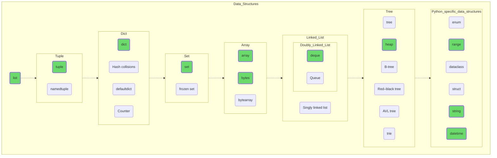
## Манипуляция данными

Пробуйте управлять вашими данными, почувствуйте, как вы можете лепить всё что угодно из этой податливой глины. Попробуйте создать структуру данных на много элементов (миллион, например), отсортируйте (sort) их, молниеносно найдите нужные значения при помощи bisect и запишите полученные результаты в JSON-файл.

Если всё идет по плану, попробуйте копнуть «серые» темы: примените regex для решения какой-нибудь несложной задачи или запишите ранее полученные данные в формате Pickle, наглядно, по размеру получившихся файлов, поняв, зачем нужны двоичные форматы файлов.

Здесь вы видите первые пункты, помеченные оранжевым. Погуглите, что такое TensorFlow и Keras, какие задачи они решают. Может быть, это ваша будущая работа, ваше призвание?

```mermaid
flowchart TD

subgraph Data_Management
direction LR
slice(slice) -.-> Sorting -.-> Comprehension -.-> String_Management -.-> Datetime_Management -.-> bisect(bisect) -.-> Functools -.->File -.-> Data_Analysis -.-> Neural_Networks
subgraph Sorting
direction LR
sort(sort)
sorted(sorted)
end

subgraph Comprehension
direction LR
listcomprehension(list)
dictcomprehension(dict)
setcomprehension(set)
end

subgraph String_Management
direction LR
String_Built-in_Functions("Built-in functions")
regex(regex)
end

subgraph Datetime_Management
direction LR
encode(encode)
decode(decode)
dtmath(math)
end

subgraph Functools
direction LR
fmap(map)
ffilter(filter)
freduce(reduce)
fpartial(partial)
fmore(...)
end

subgraph File
direction LR
Read_Write("read/write")
Text_Binary("text/binary")
JSON(JSON)
Pickle("Pickle")
Protocol_Buffers("Protocol Buffers")
paths(paths)
end

subgraph Data_Analysis
direction LR
Data_Built-in_Functions("Built-in functions")
NumPy(NumPy)
Pandas(Pandas)
end

subgraph Neural_Networks
direction LR
TensorFlow(TensorFlow)
Keras(Keras)
end

end

classDef trainee fill:#6ADA6A, stroke-width:3px
classDef middle fill:#FF9900, stroke-width:3px

class List trainee;
class tuple trainee;
class dict trainee;
class set trainee;
class array trainee;
class bytes trainee;
class deque trainee;
class heap trainee;
class range trainee;
class string trainee;
class datetime trainee;
class slice trainee;
class sort trainee;
class sorted trainee;
class listcomprehension trainee;
class bisect trainee;
class fmap trainee;
class ffilter trainee;
class freduce trainee;
class String_Built-in_Functions trainee;
class encode trainee;
class decode trainee;
class Read_Write trainee;
class Text_Binary trainee;
class JSON trainee;
class paths trainee;
class Data_Built-in_Functions trainee;
class icount trainee;
class icycle trainee;
class irepeat trainee;
class pairwise trainee;
class product trainee;
class combinations trainee;
class enumerate trainee;
class generator trainee;
class decorator trainee;
class context trainee;
class oopBase1 trainee;
class oop_property trainee;
class staticmethod trainee;
class classmethod trainee;
class slots trainee;
class Comparable trainee;
class Hashable trainee;
class Sortable trainee;
class Iterable trainee;
class Collection trainee;
class shallow trainee;
class deep trainee;
class objInheritance trainee;
class Multiple_Inheritance trainee;
class MRO trainee;
class reference_counting trainee;
class garbage_collector trainee;
class GIL trainee;
class args_kwargs trainee;
class lambda trainee;
class exception_handling trainee;
class built_in_exceptions trainee;
class exception_raising trainee;
class create_task trainee;
class gather trainee;
class sleep trainee;
class run trainee;
class wait_for trainee;
class asQueue trainee;
class Lock trainee;
class Event trainee;
class variables trainee;
class Thread trainee;
class Pool trainee;
class Stopwatch trainee;
class timeit trainee;
class random_mod trainee;
class input trainee;
class Command_Line_Arguments trainee;
class simple_print trainee;
class MD5 trainee;
class AES trainee;
class pytest trainee;
class FizzBuzz trainee;
class BubbleSort trainee;
class QuickSort trainee;
class RadixSort trainee;
class Adjacency_Matrix trainee;
class Adjacency_List trainee;
class Linear_Search trainee;
class Binary_Search trainee;
class DFS trainee;
class bigo trainee;
class divide_and_conquer trainee;
class Greedy_algorithm trainee;
class Recursion trainee;
class Relational_model trainee;
class Transaction trainee;
class Isolation trainee;
class PostgreSQL_benefits trainee;
class peewee trainee;
class CREATE trainee;
class ALTER trainee;
class DROP trainee;
class SELECT trainee;
class INSERT trainee;
class UPDATE trainee;
class DELETE trainee;
class PRIMARY_KEY trainee;
class FOREIGN_KEY trainee;
class FROM trainee;
class WHERE trainee;
class SET trainee;
class SQLite_benefits trainee;
class Syntax_Diagrams trainee;
class Flask trainee;
class Consistency trainee;
class HTTPS trainee;
class requests trainee;
class websocket trainee;
class GitHub_Actions trainee;
class WhatIsArch trainee;
class SRP trainee;
class OCP trainee;
class LSP trainee;
class ISP trainee;
class DIP trainee;
class coupling_vs_cohesion trainee;
class Procedural trainee;
class parObject-oriented trainee;
class ooInheritance trainee;
class Encapsulation trainee;
class Polymorphism trainee;
class Abstraction trainee;
class trunk_based_development trainee;
class aiohttp trainee;
class StreamHandler trainee;
class Observer trainee;
class Decorator_Method trainee;
class Factory_Method trainee;
class Adapter_Facade trainee;
class CQRS trainee;
class Decentralization trainee;
class Smart_endpoints_dumb_pipes trainee;
class Basics trainee;
class GitHub trainee;
class Install trainee;
class Directory_Structure trainee;
class Terminal trainee;

class bash middle;
class System_administration middle;
class Network_administration middle;
class NoSQL middle;
class Functional middle;
class RabbitMQ middle;
class Scrum middle;
class Apache_Kafka middle;
class Docker middle;
class methmore middle;
class PostgreSQL_more middle;
class SQLAlchemy middle;
class Django_ORM middle;
class Django middle;
class FastAPI middle;
class SQL_standard middle;
class Analyze_an_execution_plan middle;
class TensorFlow middle;
class Keras middle;
class cryptomore middle;
class Jenkins middle;
class Kubernetes middle;
class Creational_patterns middle;
class Structural_patterns middle;
class Behavioral_patterns middle;
class Architectural_Patterns middle;
class ELK_Stack middle;
class Pattern_of_Distributed_Systems middle;
class Cloud_Design_Patterns middle;
class New_Relic middle;
```
## Потоки данных

Добавьте к своим навыкам управления данными более специфичные возможности. Все рассмотренные темы крайне необходимы в процессе практического программирования и в том или ином виде присутствуют во всех современных языках. Так что если со временем вы будете переходить с Python на Java, C# или C++ — полученные знания не станут балластом.

```mermaid
flowchart TD
subgraph Data_Flows
direction LR

itertools -.-> enumerate -.-> generator -.-> Decorator -.-> context

subgraph itertools
direction LR

subgraph Infinite_Iterators
icount(count)
icycle(cycle)
irepeat(repeat)
end

subgraph Finite_Iterators
pairwise(pairwise)
chain(chain)
fimore(...)
end

subgraph Combinatorics
product(product)
combinations(combinations)
combinations_with_replacement(combinations_with_replacement)
permutations(permutations)
end
end

enumerate(enumerate)
generator(generator)

subgraph Decorator
direction LR
decorator(decorator)
LRUCache("LRU Cache")
param_decorator("Parameterized decorator")
end

context("Context manager")

end

classDef trainee fill:#6ADA6A, stroke-width:3px
classDef middle fill:#FF9900, stroke-width:3px

class List trainee;
class tuple trainee;
class dict trainee;
class set trainee;
class array trainee;
class bytes trainee;
class deque trainee;
class heap trainee;
class range trainee;
class string trainee;
class datetime trainee;
class slice trainee;
class sort trainee;
class sorted trainee;
class listcomprehension trainee;
class bisect trainee;
class fmap trainee;
class ffilter trainee;
class freduce trainee;
class String_Built-in_Functions trainee;
class encode trainee;
class decode trainee;
class Read_Write trainee;
class Text_Binary trainee;
class JSON trainee;
class paths trainee;
class Data_Built-in_Functions trainee;
class icount trainee;
class icycle trainee;
class irepeat trainee;
class pairwise trainee;
class product trainee;
class combinations trainee;
class enumerate trainee;
class generator trainee;
class decorator trainee;
class context trainee;
class oopBase1 trainee;
class oop_property trainee;
class staticmethod trainee;
class classmethod trainee;
class slots trainee;
class Comparable trainee;
class Hashable trainee;
class Sortable trainee;
class Iterable trainee;
class Collection trainee;
class shallow trainee;
class deep trainee;
class objInheritance trainee;
class Multiple_Inheritance trainee;
class MRO trainee;
class reference_counting trainee;
class garbage_collector trainee;
class GIL trainee;
class args_kwargs trainee;
class lambda trainee;
class exception_handling trainee;
class built_in_exceptions trainee;
class exception_raising trainee;
class create_task trainee;
class gather trainee;
class wait_for trainee;
class asQueue trainee;
class Lock trainee;
class Event trainee;
class variables trainee;
class Thread trainee;
class Pool trainee;
class Logging trainee;
class Stopwatch trainee;
class timeit trainee;
class Random trainee;
class input trainee;
class Command_Line_Arguments trainee;
class simple_print trainee;
class MD5 trainee;
class AES trainee;
class pytest trainee;
class FizzBuzz trainee;
class BubbleSort trainee;
class QuickSort trainee;
class RadixSort trainee;
class Adjacency_Matrix trainee;
class Adjacency_List trainee;
class Linear_Search trainee;
class Binary_Search trainee;
class DFS trainee;
class bigo trainee;
class divide_and_conquer trainee;
class Greedy_algorithm trainee;
class Recursion trainee;
class Relational_model trainee;
class Transaction trainee;
class Isolation trainee;
class PostgreSQL_benefits trainee;
class peewee trainee;
class CREATE trainee;
class ALTER trainee;
class DROP trainee;
class SELECT trainee;
class INSERT trainee;
class UPDATE trainee;
class DELETE trainee;
class SQLite trainee;
class Flask trainee;
class Consistency trainee;
class HTTPS trainee;
class requests trainee;
class websocket trainee;
class GitHub_Actions trainee;
class WhatIsArch trainee;
class SRP trainee;
class OCP trainee;
class LSP trainee;
class ISP trainee;
class DIP trainee;
class coupling_vs_cohesion trainee;
class Procedural trainee;
class parObject-oriented trainee;
class ooInheritance trainee;
class Encapsulation trainee;
class Polymorphism trainee;
class Abstraction trainee;
class trunk_based_development trainee;
class aiohttp trainee;

class NoSQL middle;
class Functional middle;
class RabbitMQ middle;
class Scrum middle;
class Apache_Kafka middle;
class git middle;
class Linux middle;
class Docker middle;
class methmore middle;
class PostgreSQL_more middle;
class SQLAlchemy middle;
class Django middle;
class FastAPI middle;
class ORM boldmiddleed;
class TensorFlow middle;
class Keras middle;
class cryptomore middle;
class Jenkins middle;
class Kubernetes middle;
class Architectural_Patterns middle;

```
## Объектно-ориентированное программирование

Углубитесь в тематику объектно-ориентированного программирования. Поймите, что объекты — ваши друзья, и все их особенности и свойства, даже если они на первый взгляд не совсем интуитивны, имеют чисто утилитарные причины для существования.

ООП существенно облегчает разделение, разработку и сопровождения кода, не просто делая очень сложные задачи подъемными для программистов средней руки, но и делая управляемее, предсказуемее и лучше мир вокруг нас.

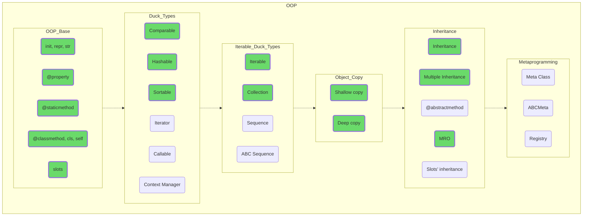
## Специфика языка

Так, отлично, еще немного глубже. Изучение особенностей работы GIL или GC даст вам понимание, почему в том или ином случае всё идет наперекосяк, совсем не так, как вы планировали. А исключения вы, возможно, уже вовсю используете, учитывая их возможное возникновение при некоторых операциях со структурами данных, так что просто изучите их поглубже.

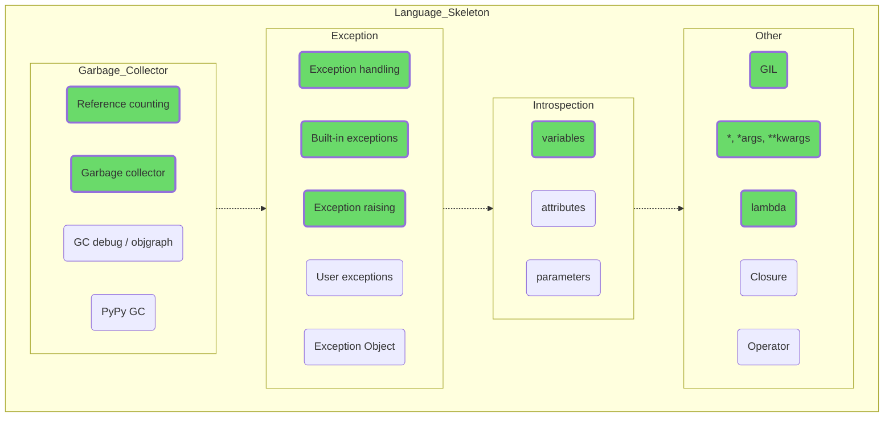
## Многопоточность и многопроцессорность

Прежде чем погрузиться в изучение многопоточности и многопроцессной обработки данных, обязательно изучите их типовые сценарии использования. Возможны ситуации, когда выигрыш будет минимальным или будет отсутствовать вовсе.

Попробуйте реализовать совместную быструю обработку данных и ожидание пользовательского ввода, меняющего исходные данные для расчетов, это даст вам понимание возможностей, плюсов и минусов разных подходов.

Не пытайтесь использовать сразу все возможности, предоставляемые Python, отталкивайтесь от решаемой задачи.

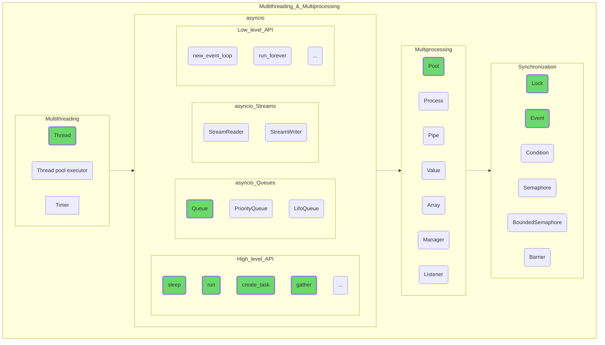
## Общая практика

Описание распространенных подходов, используемых практически во всех программных проектах, и не только на Python. Ввод-вывод, профилирование, логгирование применимо абсолютно везде.

Тестирование вообще составляет отдельную профессию, и часто о качестве программного продукта можно судить по тестовому покрытию исходного кода. Например, код базы данных SQLite [покрыт](https://www.sqlite.org/testing.html) тестами на 100 %, а на одну строку «боевого» кода приходится 608 строк тестов.  
Проекты со стопроцентным покрытием встречаются не часто, но с умом используемый pytest служит лучшим гарантом вашего крепкого сна по ночам, кроме шуток!  

```mermaid
flowchart TD

subgraph Common_Practice
direction LR

Logging -.-> Profiling -.-> Random -.-> Input -.-> Print -.-> Cryptography -.-> Testing

subgraph Logging
direction LR
StreamHandler(StreamHandler)
ColoredFormatter(ColoredFormatter)
Log_formatting("Log formatting")
RotatingFileHandler(RotatingFileHandler)
TimedRotatingFileHandler(TimedRotatingFileHandler)
ELK_Stack("ELK Stack")
end

subgraph Profiling
direction LR
Stopwatch(Stopwatch)
perf_counter(perf_counter)
timeit
Call_Graph("Call Graph")
end

subgraph Random
direction LR
random_mod(random)
secrets(secrets)
end

subgraph Input
direction LR
input(input)
Command_Line_Arguments("Command Line Arguments")
Argument_Parser("Argument Parser")
end

subgraph Print
direction LR
simple_print(print)
json_print("json.dumps")
Pretty_Print(pprint)
end

subgraph Cryptography
direction LR
MD5(MD5)
AES(AES)
cryptomore("...")
end

subgraph Testing
direction LR
pytest(pytest)
mock(mock)
end

end

classDef trainee fill:#6ADA6A, stroke-width:3px
classDef middle fill:#FF9900, stroke-width:3px


class List trainee;
class tuple trainee;
class dict trainee;
class set trainee;
class array trainee;
class bytes trainee;
class deque trainee;
class heap trainee;
class range trainee;
class string trainee;
class datetime trainee;
class slice trainee;
class sort trainee;
class sorted trainee;
class listcomprehension trainee;
class bisect trainee;
class fmap trainee;
class ffilter trainee;
class freduce trainee;
class String_Built-in_Functions trainee;
class encode trainee;
class decode trainee;
class Read_Write trainee;
class Text_Binary trainee;
class JSON trainee;
class paths trainee;
class Data_Built-in_Functions trainee;
class icount trainee;
class icycle trainee;
class irepeat trainee;
class pairwise trainee;
class product trainee;
class combinations trainee;
class enumerate trainee;
class generator trainee;
class decorator trainee;
class context trainee;
class oopBase1 trainee;
class oop_property trainee;
class staticmethod trainee;
class classmethod trainee;
class slots trainee;
class Comparable trainee;
class Hashable trainee;
class Sortable trainee;
class Iterable trainee;
class Collection trainee;
class shallow trainee;
class deep trainee;
class objInheritance trainee;
class Multiple_Inheritance trainee;
class MRO trainee;
class reference_counting trainee;
class garbage_collector trainee;
class GIL trainee;
class args_kwargs trainee;
class lambda trainee;
class exception_handling trainee;
class built_in_exceptions trainee;
class exception_raising trainee;
class create_task trainee;
class gather trainee;
class sleep trainee;
class run trainee;
class wait_for trainee;
class asQueue trainee;
class Lock trainee;
class Event trainee;
class variables trainee;
class Thread trainee;
class Pool trainee;
class Stopwatch trainee;
class timeit trainee;
class random_mod trainee;
class input trainee;
class Command_Line_Arguments trainee;
class simple_print trainee;
class MD5 trainee;
class AES trainee;
class pytest trainee;
class FizzBuzz trainee;
class BubbleSort trainee;
class QuickSort trainee;
class RadixSort trainee;
class Adjacency_Matrix trainee;
class Adjacency_List trainee;
class Linear_Search trainee;
class Binary_Search trainee;
class DFS trainee;
class bigo trainee;
class divide_and_conquer trainee;
class Greedy_algorithm trainee;
class Recursion trainee;
class Relational_model trainee;
class Transaction trainee;
class Isolation trainee;
class PostgreSQL_benefits trainee;
class peewee trainee;
class CREATE trainee;
class ALTER trainee;
class DROP trainee;
class SELECT trainee;
class INSERT trainee;
class UPDATE trainee;
class DELETE trainee;
class PRIMARY_KEY trainee;
class FOREIGN_KEY trainee;
class FROM trainee;
class WHERE trainee;
class SET trainee;
class SQLite_benefits trainee;
class Syntax_Diagrams trainee;
class Flask trainee;
class Consistency trainee;
class HTTPS trainee;
class requests trainee;
class websocket trainee;
class GitHub_Actions trainee;
class WhatIsArch trainee;
class SRP trainee;
class OCP trainee;
class LSP trainee;
class ISP trainee;
class DIP trainee;
class coupling_vs_cohesion trainee;
class Procedural trainee;
class parObject-oriented trainee;
class ooInheritance trainee;
class Encapsulation trainee;
class Polymorphism trainee;
class Abstraction trainee;
class trunk_based_development trainee;
class aiohttp trainee;
class StreamHandler trainee;

class NoSQL middle;
class Functional middle;
class RabbitMQ middle;
class Scrum middle;
class Apache_Kafka middle;
class git middle;
class Linux middle;
class Docker middle;
class methmore middle;
class PostgreSQL_more middle;
class SQLAlchemy middle;
class Django_ORM middle;
class Django middle;
class FastAPI middle;
class SQL_standard middle;
class Analyze_an_execution_plan middle;
class TensorFlow middle;
class Keras middle;
class cryptomore middle;
class Jenkins middle;
class Kubernetes middle;
class Architectural_Patterns middle;
class ELK_Stack middle;
```
## Алгоритмы

Одна из тех областей человеческого знания, в которую можно углубляться бесконечно. Но, с другой стороны, кривая изучения этой дисциплины для покрытия практических нужд среднего программиста давно известна, так что начальные стадии не должны составить для вас особого труда. Кто знает, может быть, вам это так понравится и затянет, что со временем вы даже сможете сказать новое веское слово в дискуссии «[Равенство классов P и NP](https://en.wikipedia.org/wiki/P_versus_NP_problem)»?

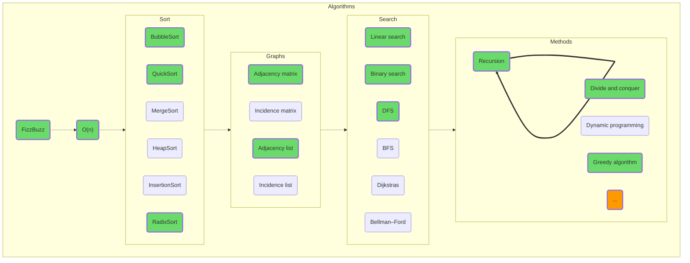
## Базы данных

Изучите сначала общие понятия, а потом специфику работы с конкретными системами управления базами данных. Попробуйте поработать с SQLite, даже если позже вы планируете перейти на PostgreSQL. SQLite является очень популярной БД, используется в Android, Chromium и еще в десятках популярных проектов. Вы же можете использовать SQLite в качестве удобного локального хранилища, как альтернативу прямой работе с файлами.

Попробуйте, кстати, ненадолго вернуться к главе первой, «Структуры данных» и разобраться, как и почему устроены внутренности баз данных.

Здесь, кстати, расположена еще одна дверь в «параллельные миры». Может быть вы захотите связать свое будущее с базами данных, став [DBA](https://en.wikipedia.org/wiki/Database_administrator)?

```mermaid
flowchart TD

subgraph Database
direction LR

Database_basics -.-> SQL -.-> SQLite -.-> MySQL -.-> PostgreSQL -.-> ORM -.-> Analyze_an_execution_plan

subgraph Database_basics
direction LR
Relational_model("Relational model")
Transaction(Transaction)
subgraph ACID
Consistency(Consistency)
Isolation(Isolation)
end
Nplusone("N+1 problem")
SQL_injection("SQL injection")
NoSQL(NoSQL)
end

subgraph SQL
direction LR

subgraph DDL
CREATE(CREATE)
ALTER(ALTER)
DROP(DROP)
PRIMARY_KEY("PRIMARY KEY")
FOREIGN_KEY("FOREIGN KEY")
ddlmore("...")
end

subgraph DML
SELECT(SELECT)
INSERT(INSERT)
UPDATE(UPDATE)
DELETE(DELETE)
FROM(FROM)
WHERE(WHERE)
SET(SET)

dmlmore("...")
end

DCL(DCL)
TCL(TCL)
SQL_standard("SQL standard")

end

subgraph SQLite
direction LR
SQLite_benefits("SQLite benefits")
Syntax_Diagrams("Syntax Diagrams")
DB_Browser_for_SQLite("DB Browser for SQLite")
end

subgraph MySQL
direction LR
MySQL_Workbench("MySQL Workbench")
end

subgraph PostgreSQL
direction LR
PostgreSQL_benefits("PostgreSQL benefits")
psql(psql)
pgAdmin(pgAdmin)
PostgreSQL_more("...")
end

subgraph ORM
direction LR
peewee(peewee)
SQLAlchemy(SQLAlchemy)
Django_ORM("Django ORM")
end

Analyze_an_execution_plan("Analyze an execution plan")

end
classDef trainee fill:#6ADA6A, stroke-width:3px
classDef middle fill:#FF9900, stroke-width:3px

class List trainee;
class tuple trainee;
class dict trainee;
class set trainee;
class array trainee;
class bytes trainee;
class deque trainee;
class heap trainee;
class range trainee;
class string trainee;
class datetime trainee;
class slice trainee;
class sort trainee;
class sorted trainee;
class listcomprehension trainee;
class bisect trainee;
class fmap trainee;
class ffilter trainee;
class freduce trainee;
class String_Built-in_Functions trainee;
class encode trainee;
class decode trainee;
class Read_Write trainee;
class Text_Binary trainee;
class JSON trainee;
class paths trainee;
class Data_Built-in_Functions trainee;
class icount trainee;
class icycle trainee;
class irepeat trainee;
class pairwise trainee;
class product trainee;
class combinations trainee;
class enumerate trainee;
class generator trainee;
class decorator trainee;
class context trainee;
class oopBase1 trainee;
class oop_property trainee;
class staticmethod trainee;
class classmethod trainee;
class slots trainee;
class Comparable trainee;
class Hashable trainee;
class Sortable trainee;
class Iterable trainee;
class Collection trainee;
class shallow trainee;
class deep trainee;
class objInheritance trainee;
class Multiple_Inheritance trainee;
class MRO trainee;
class reference_counting trainee;
class garbage_collector trainee;
class GIL trainee;
class args_kwargs trainee;
class lambda trainee;
class exception_handling trainee;
class built_in_exceptions trainee;
class exception_raising trainee;
class create_task trainee;
class gather trainee;
class wait_for trainee;
class asQueue trainee;
class Lock trainee;
class Event trainee;
class variables trainee;
class Thread trainee;
class Pool trainee;
class Logging trainee;
class Stopwatch trainee;
class timeit trainee;
class Random trainee;
class input trainee;
class Command_Line_Arguments trainee;
class simple_print trainee;
class MD5 trainee;
class AES trainee;
class pytest trainee;
class FizzBuzz trainee;
class BubbleSort trainee;
class QuickSort trainee;
class RadixSort trainee;
class Adjacency_Matrix trainee;
class Adjacency_List trainee;
class Linear_Search trainee;
class Binary_Search trainee;
class DFS trainee;
class bigo trainee;
class divide_and_conquer trainee;
class Greedy_algorithm trainee;
class Recursion trainee;
class Relational_model trainee;
class Transaction trainee;
class Isolation trainee;
class PostgreSQL_benefits trainee;
class peewee trainee;
class CREATE trainee;
class ALTER trainee;
class DROP trainee;
class SELECT trainee;
class INSERT trainee;
class UPDATE trainee;
class DELETE trainee;
class PRIMARY_KEY trainee;
class FOREIGN_KEY trainee;
class FROM trainee;
class WHERE trainee;
class SET trainee;
class SQLite_benefits trainee;
class Syntax_Diagrams trainee;
class Flask trainee;
class Consistency trainee;
class HTTPS trainee;
class requests trainee;
class websocket trainee;
class GitHub_Actions trainee;
class WhatIsArch trainee;
class SRP trainee;
class OCP trainee;
class LSP trainee;
class ISP trainee;
class DIP trainee;
class coupling_vs_cohesion trainee;
class Procedural trainee;
class parObject-oriented trainee;
class ooInheritance trainee;
class Encapsulation trainee;
class Polymorphism trainee;
class Abstraction trainee;
class trunk_based_development trainee;
class aiohttp trainee;

class NoSQL middle;
class Functional middle;
class RabbitMQ middle;
class Scrum middle;
class Apache_Kafka middle;
class git middle;
class Linux middle;
class Docker middle;
class methmore middle;
class PostgreSQL_more middle;
class SQLAlchemy middle;
class Django_ORM middle;
class Django middle;
class FastAPI middle;
class SQL_standard middle;
class Analyze_an_execution_plan middle;
class TensorFlow middle;
class Keras middle;
class cryptomore middle;
class Jenkins middle;
class Kubernetes middle;
class Architectural_Patterns middle;
```
## Сеть

Попробуйте сделать клиента и сервер, «подергайте» какой-нибудь популярный сайт или открытое API. Тут вы, кстати, вполне можете поэкспериментировать с HTML, CSS и даже с Java(Type)Script. Кто знает, может быть, ваш вариант — стать фуллстек программистом, сочетающим бек и фронт?

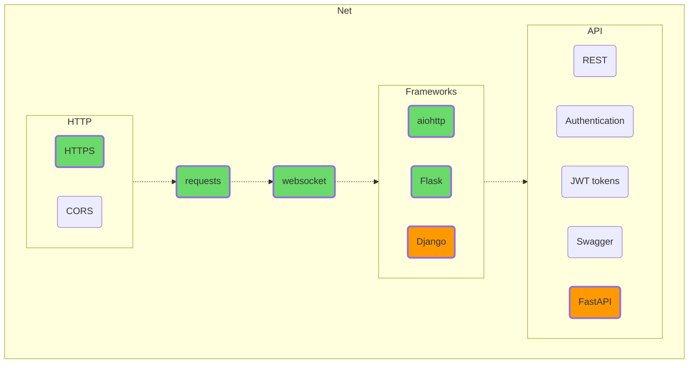
## Архитектура

Пожалуйста, постарайтесь не заучивать архитектурные принципы наизусть, это не бессмертные стихи Александра «Наше Всё» Пушкина. Никому еще не прибавляло ума бубнение о том, что «Принцип подстановки Барбары Лисков означает, что если S является подтипом T, тогда объекты типа T в программе могут быть...».  
Просто попробуйте приложить тот же LSP к программе, которую пишете. Что вам даст соблюдение этого принципа? Какие проблемы последуют за его несоблюдением? Какую цену придётся заплатить за его имплементацию и поддержку?

Попробуйте поиграться с функциональной парадигмой. Применение функционального подхода и его практическое использование вполне возможно не только в Haskell или F#, но и в Python, причём совершенно не обязательно делать это только в рамках functools.

Разберитесь, что стоит за просьбой интервьюера «Сказать три главных слова» (если что, это не «я тебя люблю», а «наследование, инкапсуляция, полиморфизм») и почему следует дополнить эту триаду понятием «уровень абстракции».

Попробуйте понять, с какими конкретными, осязаемыми проблемами старых парадигм столкнулись разработчики Agile или популяризаторы микросервисной архитектуры. Разберитесь, чем плох main(), который вызывает все остальные процедуры, ведь в эмбеддед программировании это распространенная практика. Взвесьте цену дополнительных слоёв абстракции, наворачиваемых между корневой бизнес-логикой и внешним миром.

```mermaid
flowchart TD

subgraph Architecture
direction LR
WhatIsArch -.-> Principles -.-> Paradigms -.-> Object-oriented -.-> Design_Patterns -.-> Microservices -.-> System_Design -.-> Practices

WhatIsArch("What is?")
subgraph Principles
direction LR

subgraph SOLID
SRP(SRP)
OCP(OCP)
LSP(LSP)
ISP(ISP)
DIP(DIP)
end

coupling_vs_cohesion("Coupling vs cohesion")
KISS(KISS)
DRY(DRY)
YAGNI(YAGNI)

end

subgraph Paradigms
direction LR
Procedural(Procedural)
Structured(Structured)
parObject-oriented(Object-oriented)
Functional(Functional)
end

subgraph Object-oriented
direction LR
ooInheritance(Inheritance)
Encapsulation(Encapsulation)
Polymorphism(Polymorphism)
Abstraction(Abstraction)
end

subgraph Microservices
direction LR

Decentralization(Decentralization)
Smart_endpoints_dumb_pipes("Smart endpoints, dumb pipes")
Design_for_failure("Design for failure")

subgraph Messaging
direction LR
RabbitMQ(RabbitMQ)
Apache_Kafka("Apache Kafka")
end
end

subgraph Design_Patterns
direction LR

Observer(Observer)
Decorator_Method(Decorator)
Factory_Method("Factory Method")
Adapter_Facade("Adapter, Facade")

Creational_patterns("Creational patterns")
Structural_patterns("Structural patterns")
Behavioral_patterns("Behavioral patterns")
end

subgraph System_Design
direction LR
CQRS(CQRS)
Two_Phase_Commit("Two-Phase Commit")
Load_Balanced_Services("Load-Balanced Services")
Pattern_of_Distributed_Systems("Patterns of Distributed Systems")
Cloud_Design_Patterns("Cloud Design Patterns")
end

subgraph Practices
direction LR
Agile(Agile)
Scrum(Scrum)
Kanban(Kanban)
end

end

classDef trainee fill:#6ADA6A, stroke-width:3px
classDef middle fill:#FF9900, stroke-width:3px

class List trainee;
class tuple trainee;
class dict trainee;
class set trainee;
class array trainee;
class bytes trainee;
class deque trainee;
class heap trainee;
class range trainee;
class string trainee;
class datetime trainee;
class slice trainee;
class sort trainee;
class sorted trainee;
class listcomprehension trainee;
class bisect trainee;
class fmap trainee;
class ffilter trainee;
class freduce trainee;
class String_Built-in_Functions trainee;
class encode trainee;
class decode trainee;
class Read_Write trainee;
class Text_Binary trainee;
class JSON trainee;
class paths trainee;
class Data_Built-in_Functions trainee;
class icount trainee;
class icycle trainee;
class irepeat trainee;
class pairwise trainee;
class product trainee;
class combinations trainee;
class enumerate trainee;
class generator trainee;
class decorator trainee;
class context trainee;
class oopBase1 trainee;
class oop_property trainee;
class staticmethod trainee;
class classmethod trainee;
class slots trainee;
class Comparable trainee;
class Hashable trainee;
class Sortable trainee;
class Iterable trainee;
class Collection trainee;
class shallow trainee;
class deep trainee;
class objInheritance trainee;
class Multiple_Inheritance trainee;
class MRO trainee;
class reference_counting trainee;
class garbage_collector trainee;
class GIL trainee;
class args_kwargs trainee;
class lambda trainee;
class exception_handling trainee;
class built_in_exceptions trainee;
class exception_raising trainee;
class create_task trainee;
class gather trainee;
class sleep trainee;
class run trainee;
class wait_for trainee;
class asQueue trainee;
class Lock trainee;
class Event trainee;
class variables trainee;
class Thread trainee;
class Pool trainee;
class Stopwatch trainee;
class timeit trainee;
class random_mod trainee;
class input trainee;
class Command_Line_Arguments trainee;
class simple_print trainee;
class MD5 trainee;
class AES trainee;
class pytest trainee;
class FizzBuzz trainee;
class BubbleSort trainee;
class QuickSort trainee;
class RadixSort trainee;
class Adjacency_Matrix trainee;
class Adjacency_List trainee;
class Linear_Search trainee;
class Binary_Search trainee;
class DFS trainee;
class bigo trainee;
class divide_and_conquer trainee;
class Greedy_algorithm trainee;
class Recursion trainee;
class Relational_model trainee;
class Transaction trainee;
class Isolation trainee;
class PostgreSQL_benefits trainee;
class peewee trainee;
class CREATE trainee;
class ALTER trainee;
class DROP trainee;
class SELECT trainee;
class INSERT trainee;
class UPDATE trainee;
class DELETE trainee;
class PRIMARY_KEY trainee;
class FOREIGN_KEY trainee;
class FROM trainee;
class WHERE trainee;
class SET trainee;
class SQLite_benefits trainee;
class Syntax_Diagrams trainee;
class Flask trainee;
class Consistency trainee;
class HTTPS trainee;
class requests trainee;
class websocket trainee;
class GitHub_Actions trainee;
class WhatIsArch trainee;
class SRP trainee;
class OCP trainee;
class LSP trainee;
class ISP trainee;
class DIP trainee;
class coupling_vs_cohesion trainee;
class Procedural trainee;
class parObject-oriented trainee;
class ooInheritance trainee;
class Encapsulation trainee;
class Polymorphism trainee;
class Abstraction trainee;
class trunk_based_development trainee;
class aiohttp trainee;
class StreamHandler trainee;
class Observer trainee;
class Decorator_Method trainee;
class Factory_Method trainee;
class Adapter_Facade trainee;
class CQRS trainee;
class Decentralization trainee;
class Smart_endpoints_dumb_pipes trainee;

class NoSQL middle;
class Functional middle;
class RabbitMQ middle;
class Scrum middle;
class Apache_Kafka middle;
class git middle;
class Linux middle;
class Docker middle;
class methmore middle;
class PostgreSQL_more middle;
class SQLAlchemy middle;
class Django_ORM middle;
class Django middle;
class FastAPI middle;
class SQL_standard middle;
class Analyze_an_execution_plan middle;
class TensorFlow middle;
class Keras middle;
class cryptomore middle;
class Jenkins middle;
class Kubernetes middle;
class Creational_patterns middle;
class Structural_patterns middle;
class Behavioral_patterns middle;
class Architectural_Patterns middle;
class ELK_Stack middle;
class Pattern_of_Distributed_Systems middle;
class Cloud_Design_Patterns middle;
```
## Развёртывание и администрирование

Несмотря на то, что темы «git» и особенно «Linux» весьма непросты и объемны, начало кривой обучения у них не очень крутое, поэтому я крайне рекомендую начать освоение DevOps с освоения git'а (хотя бы в объёме add-commit-push, так у вас останется неидеальная, но всё же история изменений) и Linux (в объёме PuTTY + WinSCP, например; скопируйте ваши Python-скрипты через SSH и запустите их на удалённой Linux-машине). На Stepik'е, например, есть прекрасные русскоязычные курсы, подробно объясняющие, кто на ком стоял, а уж сосчитать хорошие англоязычные мануалы по этим тематикам не хватит пальцев у самого распоясавшегося мутанта.  
Поверьте, Linux-консоль, выглядящая на первый взгляд такой непривычной и неудобной, покажется вам гораздо дружелюбнее, когда вы начнете изучать vim. Всё познается в сравнении!  

Что ж, здесь наша карта заканчивается. Попробуйте дойти до последнего зеленого раздела, GitHub Actions; прогоните, например, линтер для своего open source проекта (GitHub Actions бесплатен для проектов с открытым исходным кодом).  

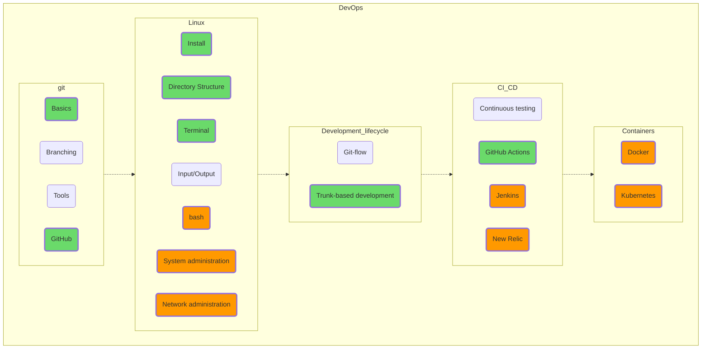
## Общая диаграмма

Суммарную диаграмму мы получим простым механическим сложением предыдущих пунктов, просто чтобы вы могли посмотреть на то, что у нас в результате получилось. Финальные [Mermaid](https://github.com/amaargiru/pyroad/blob/main/13_Full.md), [svg](https://raw.githubusercontent.com/amaargiru/pyroad/main/pics_svg/13_Full.svg), [png](https://raw.githubusercontent.com/amaargiru/pyroad/main/pics_png/13_Full.png).

```mermaid
flowchart TD
Data_Structures ==> Data_Management ==> Data_Flows ==> OOP ==> Language_Skeleton ==> Multithreading_&_Multiprocessing ==> Common_Practice ==> Algorithms ==> Database ==> Net ==> Architecture ==> DevOps

subgraph Data_Structures
direction LR
List(list) -.-> Tuple -.-> Dict -.-> Set -.-> Array -.-> Linked_List -.->Tree -.-> Python_specific_data_structures

subgraph Tuple
direction LR
tuple(tuple)
namedtuple(namedtuple)
end

subgraph Dict
direction LR
dict(dict)
HashProblem("Hash collisions")
defaultdict(defaultdict)
Counter(Counter)
end

subgraph Set
direction LR
set(set)
FrozenSet("frozen set")
end

subgraph Array
direction LR
array(array)
bytes(bytes)
bytearray(bytearray)
end

subgraph Linked_List
direction LR
SinglyLinkedList("Singly linked list")
subgraph Doubly_Linked_List
direction LR
deque(deque)
Queue(Queue)
end
end

subgraph Tree
direction LR
tree(tree)
heap(heap)
B-tree(B-tree)
RedBlackTree("Red–black tree")
AVLTree("AVL tree")
trie(trie)
end

subgraph Python_specific_data_structures
direction LR
enum(enum)
range(range)
dataclass(dataclass)
struct(struct)
string(string)
datetime(datetime)
end
end

subgraph Data_Management
direction LR
slice(slice) -.-> Sorting -.-> Comprehension -.-> String_Management -.-> Datetime_Management -.-> bisect(bisect) -.-> Functools -.->File -.-> Data_Analysis -.-> Neural_Networks
subgraph Sorting
direction LR
sort(sort)
sorted(sorted)
end

subgraph Comprehension
direction LR
listcomprehension(list)
dictcomprehension(dict)
setcomprehension(set)
end

subgraph String_Management
direction LR
String_Built-in_Functions("Built-in functions")
regex(regex)
end

subgraph Datetime_Management
direction LR
encode(encode)
decode(decode)
dtmath(math)
end

subgraph Functools
direction LR
fmap(map)
ffilter(filter)
freduce(reduce)
fpartial(partial)
fmore(...)
end

subgraph File
direction LR
Read_Write("read/write")
Text_Binary("text/binary")
JSON(JSON)
Pickle("Pickle")
Protocol_Buffers("Protocol Buffers")
paths(paths)
end

subgraph Data_Analysis
direction LR
Data_Built-in_Functions("Built-in functions")
NumPy(NumPy)
Pandas(Pandas)
end

subgraph Neural_Networks
direction LR
TensorFlow(TensorFlow)
Keras(Keras)
end

end

subgraph Data_Flows
direction LR

itertools -.-> enumerate -.-> generator -.-> Decorator -.-> context

subgraph itertools
direction LR

subgraph Infinite_Iterators
icount(count)
icycle(cycle)
irepeat(repeat)
end

subgraph Finite_Iterators
pairwise(pairwise)
chain(chain)
fimore(...)
end

subgraph Combinatorics
product(product)
combinations(combinations)
combinations_with_replacement(combinations_with_replacement)
permutations(permutations)
end
end

enumerate(enumerate)
generator(generator)

subgraph Decorator
direction LR
decorator(decorator)
LRUCache("LRU Cache")
param_decorator("Parameterized decorator")
end

context("Context manager")

end

subgraph OOP
direction LR
OOP_Base -.-> Duck_Types -.-> Iterable_Duck_Types -.-> Object_Copy -.->Inheritance -.-> Metaprogramming

subgraph OOP_Base
direction LR
oopBase1("init, repr, str")
oop_property("@property")
staticmethod("@staticmethod")
classmethod("@classmethod, cls, self")
slots(slots)
end

subgraph Duck_Types
direction LR
Comparable(Comparable)
Hashable(Hashable)
Sortable(Sortable)
Iterator(Iterator)
Callable(Callable)
dt_Context_Manager("Context Manager")
end

subgraph Iterable_Duck_Types
direction LR
Iterable(Iterable)
Collection(Collection)
Sequence(Sequence)
ABC_Sequence("ABC Sequence")
end

subgraph Object_Copy
direction LR
shallow("Shallow copy")
deep("Deep copy")
end

subgraph Inheritance
direction LR
objInheritance(Inheritance)
Multiple_Inheritance("Multiple Inheritance")
abstractmethod("@abstractmethod")
MRO(MRO)
Inheritance_of_slots("Slots' inheritance")
end

subgraph Metaprogramming
direction LR
Metaclass("Meta Class")
ABCMeta(ABCMeta)
Registry(Registry)
end

end

subgraph Language_Skeleton
direction LR
Garbage_Collector -.-> Exception -.-> Introspection -.-> Other

subgraph Garbage_Collector
direction LR
reference_counting("Reference counting")
garbage_collector("Garbage collector")
debug_objgraph("GC debug / objgraph")
pypygc("PyPy GC")
end

subgraph Exception
direction LR
exception_handling("Exception handling")
built_in_exceptions("Built-in exceptions")
exception_raising("Exception raising")
user_exception("User exceptions")
exception_object("Exception Object")
end

subgraph Introspection
direction LR
variables(variables)
attributes(attributes)
parameters(parameters)
end

subgraph Other
direction LR
GIL(GIL)
args_kwargs("*, *args, **kwargs")
lambda(lambda)
Closure(Closure)
Operator(Operator)
end

end

subgraph Multithreading_&_Multiprocessing
direction LR

Multithreading -.-> asyncio -.-> Multiprocessing -.->Synchronization

subgraph Multithreading
direction LR
Thread(Thread)
Thread_Pool_Executor("Thread pool executor")
Timer
end

subgraph asyncio
direction LR
subgraph High_level_API
sleep(sleep)
run(run)
create_task(create_task)
gather(gather)
hilapi_more("...")
end
subgraph asyncio_Queues
asQueue(Queue)
asPriorityQueue(PriorityQueue)
asLifoQueue(LifoQueue)
end
subgraph asyncio_Streams
StreamReader(StreamReader)
StreamWriter(StreamWriter)
end
subgraph Low_level_API
new_event_loop(new_event_loop)
run_forever(run_forever)
lowlapi_more("...")
end
end

subgraph Multiprocessing
direction LR
Pool(Pool)
Process(Process)
Pipe(Pipe)
Value(Value)
muArray(Array)
Manager(Manager)
Listener(Listener)
end

subgraph Synchronization
direction LR
Lock(Lock)
Event(Event)
Condition(Condition)
Semaphore(Semaphore)
BoundedSemaphore(BoundedSemaphore)
Barrier(Barrier)
end

end

subgraph Common_Practice
direction LR

Logging -.-> Profiling -.-> Random -.-> Input -.-> Print -.-> Cryptography -.-> Testing

subgraph Logging
direction LR
StreamHandler(StreamHandler)
ColoredFormatter(ColoredFormatter)
Log_formatting("Log formatting")
RotatingFileHandler(RotatingFileHandler)
TimedRotatingFileHandler(TimedRotatingFileHandler)
ELK_Stack("ELK Stack")
end

subgraph Profiling
direction LR
Stopwatch(Stopwatch)
perf_counter(perf_counter)
timeit
Call_Graph("Call Graph")
end

subgraph Random
direction LR
random_mod(random)
secrets(secrets)
end

subgraph Input
direction LR
input(input)
Command_Line_Arguments("Command Line Arguments")
Argument_Parser("Argument Parser")
end

subgraph Print
direction LR
simple_print(print)
json_print("json.dumps")
Pretty_Print(pprint)
end

subgraph Cryptography
direction LR
MD5(MD5)
AES(AES)
cryptomore("...")
end

subgraph Testing
direction LR
pytest(pytest)
mock(mock)
end

end

subgraph Algorithms
direction LR
FizzBuzz -.-> bigo -.-> Sort -.-> Graphs -.-> Search -.-> Methods
Recursion ==> Recursion

FizzBuzz(FizzBuzz)
bigo("O(n)")

subgraph Sort
direction LR
BubbleSort(BubbleSort)
QuickSort(QuickSort)
MergeSort(MergeSort)
HeapSort(HeapSort)
InsertionSort(InsertionSort)
RadixSort(RadixSort)
end

subgraph Graphs
direction LR
Adjacency_Matrix("Adjacency matrix")
Incidence_Matrix("Incidence matrix")
Adjacency_List("Adjacency list")
Incidence_List("Incidence list")
end

subgraph Search
direction LR
Linear_Search("Linear search")
Binary_Search("Binary search")
DFS(DFS)
BFS(BFS)
Dijkstras(Dijkstras)
Bellman_Ford("Bellman–Ford")
end

subgraph Methods
direction LR
divide_and_conquer("Divide and conquer")
Dynamic_programming("Dynamic programming")
Greedy_algorithm("Greedy algorithm")
Recursion(Recursion)
methmore("...")
end

end

subgraph Database
direction LR

Database_basics -.-> SQL -.-> SQLite -.-> MySQL -.-> PostgreSQL -.-> ORM -.-> Analyze_an_execution_plan

subgraph Database_basics
direction LR
Relational_model("Relational model")
Transaction(Transaction)
subgraph ACID
Consistency(Consistency)
Isolation(Isolation)
end
Nplusone("N+1 problem")
SQL_injection("SQL injection")
NoSQL(NoSQL)
end

subgraph SQL
direction LR

subgraph DDL
CREATE(CREATE)
ALTER(ALTER)
DROP(DROP)
PRIMARY_KEY("PRIMARY KEY")
FOREIGN_KEY("FOREIGN KEY")
ddlmore("...")
end

subgraph DML
SELECT(SELECT)
INSERT(INSERT)
UPDATE(UPDATE)
DELETE(DELETE)
FROM(FROM)
WHERE(WHERE)
SET(SET)

dmlmore("...")
end

DCL(DCL)
TCL(TCL)
SQL_standard("SQL standard")

end

subgraph SQLite
direction LR
SQLite_benefits("SQLite benefits")
Syntax_Diagrams("Syntax Diagrams")
DB_Browser_for_SQLite("DB Browser for SQLite")
end

subgraph MySQL
direction LR
MySQL_Workbench("MySQL Workbench")
end

subgraph PostgreSQL
direction LR
PostgreSQL_benefits("PostgreSQL benefits")
psql(psql)
pgAdmin(pgAdmin)
PostgreSQL_more("...")
end

subgraph ORM
direction LR
peewee(peewee)
SQLAlchemy(SQLAlchemy)
Django_ORM("Django ORM")
end

Analyze_an_execution_plan("Analyze an execution plan")

end

subgraph Net
direction LR
HTTP -.-> requests -.-> websocket -.-> Frameworks -.-> API

subgraph HTTP
direction LR
HTTPS(HTTPS)
CORS(CORS)
end

requests(requests)
websocket(websocket)

subgraph Frameworks
direction LR
aiohttp(aiohttp)
Flask(Flask)
Django(Django)
end

subgraph API
direction LR
REST(REST)
Authentication(Authentication)
jwt_tokens("JWT tokens")
Swagger(Swagger)
FastAPI(FastAPI)
end

end

subgraph Architecture
direction LR
WhatIsArch -.-> Principles -.-> Paradigms -.-> Object-oriented -.-> Design_Patterns -.-> Microservices -.-> System_Design -.-> Practices

WhatIsArch("What is?")
subgraph Principles
direction LR

subgraph SOLID
SRP(SRP)
OCP(OCP)
LSP(LSP)
ISP(ISP)
DIP(DIP)
end

coupling_vs_cohesion("Coupling vs cohesion")
KISS(KISS)
DRY(DRY)
YAGNI(YAGNI)

end

subgraph Paradigms
direction LR
Procedural(Procedural)
Structured(Structured)
parObject-oriented(Object-oriented)
Functional(Functional)
end

subgraph Object-oriented
direction LR
ooInheritance(Inheritance)
Encapsulation(Encapsulation)
Polymorphism(Polymorphism)
Abstraction(Abstraction)
end

subgraph Microservices
direction LR

Decentralization(Decentralization)
Smart_endpoints_dumb_pipes("Smart endpoints, dumb pipes")
Design_for_failure("Design for failure")

subgraph Messaging
direction LR
RabbitMQ(RabbitMQ)
Apache_Kafka("Apache Kafka")
end
end

subgraph Design_Patterns
direction LR

Observer(Observer)
Decorator_Method(Decorator)
Factory_Method("Factory Method")
Adapter_Facade("Adapter, Facade")

Creational_patterns("Creational patterns")
Structural_patterns("Structural patterns")
Behavioral_patterns("Behavioral patterns")
end

subgraph System_Design
direction LR
CQRS(CQRS)
Two_Phase_Commit("Two-Phase Commit")
Load_Balanced_Services("Load-Balanced Services")
Pattern_of_Distributed_Systems("Patterns of Distributed Systems")
Cloud_Design_Patterns("Cloud Design Patterns")
end

subgraph Practices
direction LR
Agile(Agile)
Scrum(Scrum)
Kanban(Kanban)
end

end

subgraph DevOps
direction LR
git -.-> Linux -.-> Development_lifecycle -.-> CI_CD -.-> Containers

subgraph git
direction LR
Basics(Basics)
Branching(Branching)
Tools(Tools)
GitHub(GitHub)
end

subgraph Linux
direction LR
Install(Install)
Directory_Structure("Directory Structure")
Terminal(Terminal)
Input_Output("Input/Output")
bash(bash)
System_administration("System administration")
Network_administration("Network administration")
end

subgraph Development_lifecycle
direction LR
Git_flow("Git-flow")
trunk_based_development("Trunk-based development")
end

subgraph CI_CD
direction LR
Continuous_testing("Continuous testing")
GitHub_Actions("GitHub Actions")
Jenkins(Jenkins)
New_Relic("New Relic")
end

subgraph Containers
direction LR
Docker(Docker)
Kubernetes(Kubernetes)
end

end

classDef trainee fill:#6ADA6A, stroke-width:3px
classDef middle fill:#FF9900, stroke-width:3px

class List trainee;
class tuple trainee;
class dict trainee;
class set trainee;
class array trainee;
class bytes trainee;
class deque trainee;
class heap trainee;
class range trainee;
class string trainee;
class datetime trainee;
class slice trainee;
class sort trainee;
class sorted trainee;
class listcomprehension trainee;
class bisect trainee;
class fmap trainee;
class ffilter trainee;
class freduce trainee;
class String_Built-in_Functions trainee;
class encode trainee;
class decode trainee;
class Read_Write trainee;
class Text_Binary trainee;
class JSON trainee;
class paths trainee;
class Data_Built-in_Functions trainee;
class icount trainee;
class icycle trainee;
class irepeat trainee;
class pairwise trainee;
class product trainee;
class combinations trainee;
class enumerate trainee;
class generator trainee;
class decorator trainee;
class context trainee;
class oopBase1 trainee;
class oop_property trainee;
class staticmethod trainee;
class classmethod trainee;
class slots trainee;
class Comparable trainee;
class Hashable trainee;
class Sortable trainee;
class Iterable trainee;
class Collection trainee;
class shallow trainee;
class deep trainee;
class objInheritance trainee;
class Multiple_Inheritance trainee;
class MRO trainee;
class reference_counting trainee;
class garbage_collector trainee;
class GIL trainee;
class args_kwargs trainee;
class lambda trainee;
class exception_handling trainee;
class built_in_exceptions trainee;
class exception_raising trainee;
class create_task trainee;
class gather trainee;
class sleep trainee;
class run trainee;
class wait_for trainee;
class asQueue trainee;
class Lock trainee;
class Event trainee;
class variables trainee;
class Thread trainee;
class Pool trainee;
class Stopwatch trainee;
class timeit trainee;
class random_mod trainee;
class input trainee;
class Command_Line_Arguments trainee;
class simple_print trainee;
class MD5 trainee;
class AES trainee;
class pytest trainee;
class FizzBuzz trainee;
class BubbleSort trainee;
class QuickSort trainee;
class RadixSort trainee;
class Adjacency_Matrix trainee;
class Adjacency_List trainee;
class Linear_Search trainee;
class Binary_Search trainee;
class DFS trainee;
class bigo trainee;
class divide_and_conquer trainee;
class Greedy_algorithm trainee;
class Recursion trainee;
class Relational_model trainee;
class Transaction trainee;
class Isolation trainee;
class PostgreSQL_benefits trainee;
class peewee trainee;
class CREATE trainee;
class ALTER trainee;
class DROP trainee;
class SELECT trainee;
class INSERT trainee;
class UPDATE trainee;
class DELETE trainee;
class PRIMARY_KEY trainee;
class FOREIGN_KEY trainee;
class FROM trainee;
class WHERE trainee;
class SET trainee;
class SQLite_benefits trainee;
class Syntax_Diagrams trainee;
class Flask trainee;
class Consistency trainee;
class HTTPS trainee;
class requests trainee;
class websocket trainee;
class GitHub_Actions trainee;
class WhatIsArch trainee;
class SRP trainee;
class OCP trainee;
class LSP trainee;
class ISP trainee;
class DIP trainee;
class coupling_vs_cohesion trainee;
class Procedural trainee;
class parObject-oriented trainee;
class ooInheritance trainee;
class Encapsulation trainee;
class Polymorphism trainee;
class Abstraction trainee;
class trunk_based_development trainee;
class aiohttp trainee;
class StreamHandler trainee;
class Observer trainee;
class Decorator_Method trainee;
class Factory_Method trainee;
class Adapter_Facade trainee;
class CQRS trainee;
class Decentralization trainee;
class Smart_endpoints_dumb_pipes trainee;
class Basics trainee;
class GitHub trainee;
class Install trainee;
class Directory_Structure trainee;
class Terminal trainee;

class bash middle;
class System_administration middle;
class Network_administration middle;
class NoSQL middle;
class Functional middle;
class RabbitMQ middle;
class Scrum middle;
class Apache_Kafka middle;
class Docker middle;
class methmore middle;
class PostgreSQL_more middle;
class SQLAlchemy middle;
class Django_ORM middle;
class Django middle;
class FastAPI middle;
class SQL_standard middle;
class Analyze_an_execution_plan middle;
class TensorFlow middle;
class Keras middle;
class cryptomore middle;
class Jenkins middle;
class Kubernetes middle;
class Creational_patterns middle;
class Structural_patterns middle;
class Behavioral_patterns middle;
class Architectural_Patterns middle;
class ELK_Stack middle;
class Pattern_of_Distributed_Systems middle;
class Cloud_Design_Patterns middle;
class New_Relic middle;
```
## Пока всё

Как вы могли заметить, в этом материале нет ни слова на темы «управляющие конструкции», «установка IDE» или «virtualenv». Все эти темы, на мой взгляд, весьма немаловажны, но не составляют сути языка, представляя что-то вроде связующего раствора, в то время как темы, обсуждаемые в статье — от «list» до «Kubernetes», служат полноценными «кирпичами».

Напоминаю, что все диаграммы сделаны в формате Mermaid (вы можете менять картинку, просто корректируя текст), все исходники доступны на [GitHub](https://github.com/amaargiru/pyroad), корректируйте, сколько хотите, или, само собой, пишите замечания прямо в комментариях.

Я сейчас готовлю следующую публикацию для «Хабра», с массой практических примеров, исходные тексты тоже лежат на [GitHub](https://github.com/amaargiru/pycore) в формате Jupiter Notebook, который позволяет перемешивать текстовые заметки, исходные коды и результаты вывода программ. Все примеры кода интерактивны, вы можете их менять, дополнять и вообще крутить как угодно, разбираясь в тонкостях Python. На GitHub лежит только черновик, так что где-то с середины повествование начинает зажевываться, заикаться, но попрактиковаться на материале нескольких первых глав уже вполне возможно.

Отдельной строкой я приветствую всех начинающих программистов. Не верьте сладким обещаниям всевозможных курсов, публикующим уже на главной ваши будущие расценки; на самом деле, если вам, при должном упорстве, удастся устроиться на работу по профилю, то первое время зарабатывать вы будете примерно ничего и еще звездюлей в придачу. Но — на каких бы языках вы не планировали писать, как бы далеко вы не продвинулись в этом трудном деле, вы совершенно точно устроите апгрейд своему мозгу, апните понимание окружающего мира и начнете различать тайные ходы там, где раньше видели только глухие стены. Так что самое время открыть IDE, немного сосредоточится и начать практиковаться.

И — помните: «Это мой Питон. Таких питонов много, но этот — мой. Мой Питон — мой лучший друг. Он — моя жизнь. Я должен научиться владеть им так же, как я владею своей жизнью. Без меня мой Питон бесполезен. Без моего Питона бесполезен я. Я и мой Питон знаем, на что идёт счет в этой жизни — не на количество сказанных нами слов, не на количество строк кода и не на время, проведенное в офисе. Мы знаем, что счёт будет вестись только на закрытые таски. И мы будем их закрывать. Мой Питон — это человек, такой же как я, потому что это мой Питон. Я должен относиться к нему как к своему брату, я должен изучить его слабости и его силу, его части и принадлежности, его стандартную библиотеку и его инфраструктуру. Я должен хранить его от губительного недопонимания и от неоптимального использования так же, как я храню от всякого вреда свои ноги и руки, свои глаза и своё сердце. Я должен хранить своего Питона чистым и готовым. Мы станем частью друг друга. Да будет так.»
