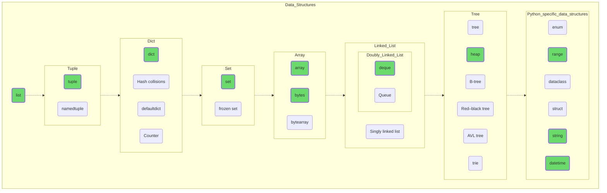

## Структуры данных

Напоминаю, если вы — начинающий разработчик, идите слева направо по пунктам, отмеченным зеленым цветом. Создайте экземпляры каждого типа, попробуйте добавить и удалить элементы, поработайте с ними в отладчике. Посмотрите, какого размера получаются объекты, попробуйте разобраться, почему list и array, содержащие одинаковые данные, отличаются в размерах. Изучите особенности каждого типа, почитайте и подумайте сами, в каких задачах какая структура данных будет смотреться оптимальнее.

Не забывайте, что это всего лишь путеводитель, оглавление для книги, которую вы должны написать сами. Активно ищите информацию в Сети, старайтесь работать с англоязычными источниками и с официальной документацией. Замените «Пикабу» и «ЯПлакал» на [Stackoverflow](https://stackoverflow.com/), там масса захватывающего чтива!

Если начинает получаться, переходите к следующему разделу, если не получается — не расстраивайтесь. Не надо ассоциировать свой ум с мечом Александра Македонского, разрубившего Гордиев узел одним чётким, уверенным движением, достойным главной страницы «Инстаграма». Будьте как рубанок — снимайте по тонкой кожурке за проход, и рано или поздно непонимание уйдёт, даже если вам кажется, что это пропасть глубиной в десять тысяч ли.

