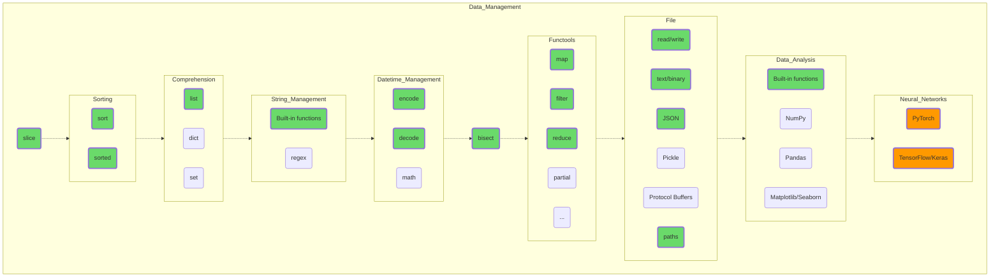

## Манипуляция данными

Пробуйте управлять вашими данными, почувствуйте, как вы можете лепить всё что угодно из этой податливой глины. Попробуйте создать структуру данных на много элементов (миллион, например), отсортируйте (sort) их, молниеносно найдите нужные значения при помощи bisect и запишите полученные результаты в JSON-файл.

Если всё идет по плану, попробуйте копнуть «серые» темы: примените regex для решения какой-нибудь несложной задачи или запишите ранее полученные данные в формате Pickle, наглядно, по размеру получившихся файлов, поняв, зачем нужны двоичные форматы файлов.

Здесь вы видите первые пункты, помеченные оранжевым. Погуглите, что такое TensorFlow и Keras, какие задачи они решают. Может быть, это ваша будущая работа, ваше призвание?

