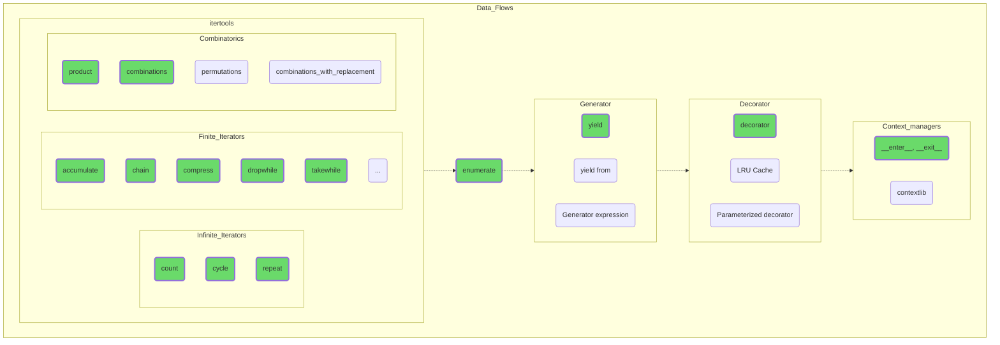

## Потоки данных

Добавьте к своим навыкам управления данными более специфичные возможности. Все рассмотренные темы крайне необходимы в процессе практического программирования и в том или ином виде присутствуют во всех современных языках. Так что если со временем вы будете переходить с Python на Java, C# или C++ — полученные знания не станут балластом.

