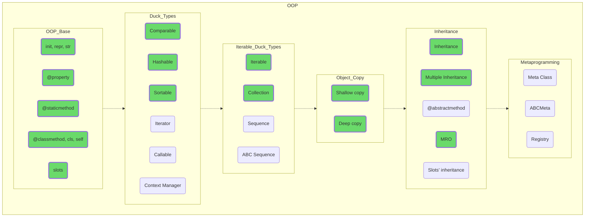

## Объектно-ориентированное программирование

Углубитесь в тематику объектно-ориентированного программирования. Поймите, что объекты — ваши друзья, и все их особенности и свойства, даже если они на первый взгляд не совсем интуитивны, имеют чисто утилитарные причины для существования.

ООП существенно облегчает разделение, разработку и сопровождения кода, не просто делая очень сложные задачи подъемными для программистов средней руки, но и делая управляемее, предсказуемее и лучше мир вокруг нас.

