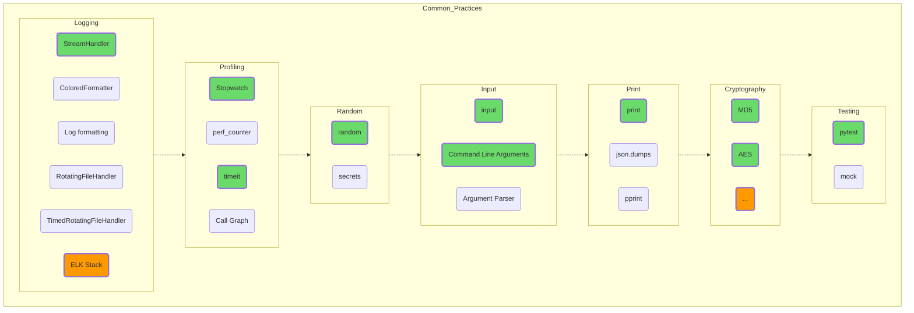

## Общая практика

Описание распространенных подходов, используемых практически во всех программных проектах, и не только на Python. Ввод-вывод, профилирование, логгирование применимо абсолютно везде.

Тестирование вообще составляет отдельную профессию, и часто о качестве программного продукта можно судить по тестовому покрытию исходного кода. Например, код базы данных SQLite [покрыт](https://www.sqlite.org/testing.html) тестами на 100 %, а на одну строку «боевого» кода приходится 608 строк тестов.  
Проекты со стопроцентным покрытием встречаются не часто, но с умом используемый pytest служит лучшим гарантом вашего крепкого сна по ночам, кроме шуток!  

