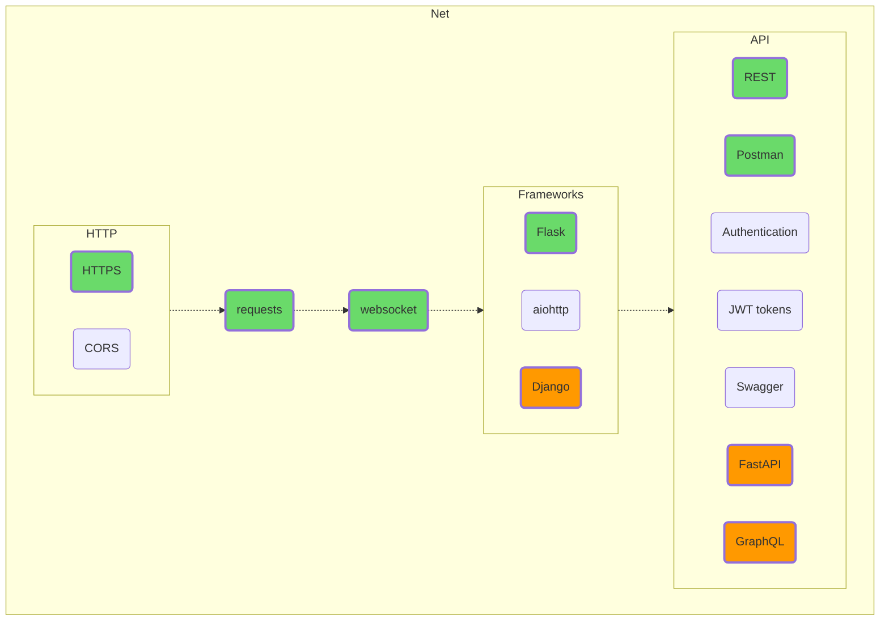

## Сеть

Попробуйте сделать клиента и сервер, «подергайте» какой-нибудь популярный сайт или открытое API. Тут вы, кстати, вполне можете поэкспериментировать с HTML, CSS и даже с Java(Type)Script. Кто знает, может быть, ваш вариант — стать фуллстек программистом, сочетающим бек и фронт?

