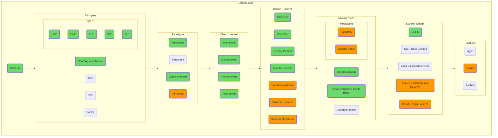

## Архитектура

Пожалуйста, постарайтесь не заучивать архитектурные принципы наизусть, это не бессмертные стихи Александра «Наше Всё» Пушкина. Никому еще не прибавляло ума бубнение о том, что «Принцип подстановки Барбары Лисков означает, что если S является подтипом T, тогда объекты типа T в программе могут быть...».  
Просто попробуйте приложить тот же LSP к программе, которую пишете. Что вам даст соблюдение этого принципа? Какие проблемы последуют за его несоблюдением? Какую цену придётся заплатить за его имплементацию и поддержку?

Попробуйте поиграться с функциональной парадигмой. Применение функционального подхода и его практическое использование вполне возможно не только в Haskell или F#, но и в Python, причём совершенно не обязательно делать это только в рамках functools.

Разберитесь, что стоит за просьбой интервьюера «Сказать три главных слова» (если что, это не «я тебя люблю», а «наследование, инкапсуляция, полиморфизм») и почему следует дополнить эту триаду понятием «уровень абстракции».

Попробуйте понять, с какими конкретными, осязаемыми проблемами старых парадигм столкнулись разработчики Agile или популяризаторы микросервисной архитектуры. Разберитесь, чем плох main(), который вызывает все остальные процедуры, ведь в эмбеддед программировании это распространенная практика. Взвесьте цену дополнительных слоёв абстракции, наворачиваемых между корневой бизнес-логикой и внешним миром.

