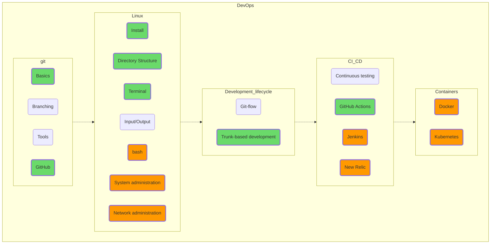

## Развёртывание и администрирование

Несмотря на то, что темы «git» и особенно «Linux» весьма непросты и объемны, начало кривой обучения у них не очень крутое, поэтому я крайне рекомендую начать освоение DevOps с освоения git'а (хотя бы в объёме add-commit-push, так у вас останется неидеальная, но всё же история изменений) и Linux (в объёме PuTTY + WinSCP, например; скопируйте ваши Python-скрипты через SSH и запустите их на удалённой Linux-машине). На Stepik'е, например, есть прекрасные русскоязычные курсы, подробно объясняющие, кто на ком стоял, а уж сосчитать хорошие англоязычные мануалы по этим тематикам не хватит пальцев у самого распоясавшегося мутанта.  
Поверьте, Linux-консоль, выглядящая на первый взгляд такой непривычной и неудобной, покажется вам гораздо дружелюбнее, когда вы начнете изучать vim. Всё познается в сравнении!  

Что ж, здесь наша карта заканчивается. Попробуйте дойти до последнего зеленого раздела, GitHub Actions; прогоните, например, линтер для своего open source проекта (GitHub Actions бесплатен для проектов с открытым исходным кодом).  

